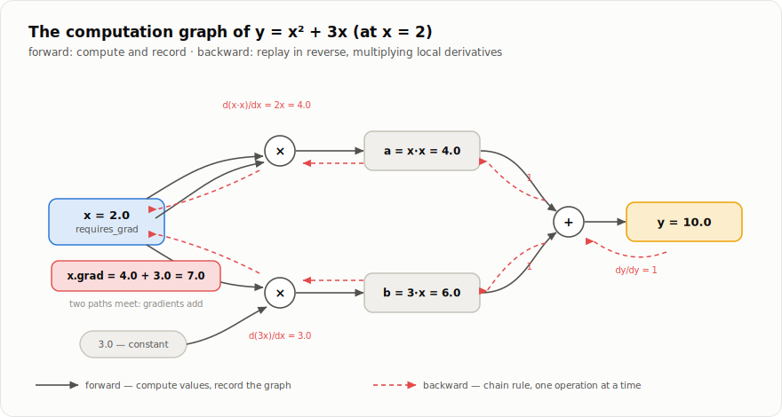

# Chapter 2 — Autograd

*Part I, chapter 2 of 4. This is the heart of every deep learning
framework. After this chapter, `loss.backward()` is not magic — it is a
recording, played in reverse.*

## Why gradients?

A neural network is a function with millions of adjustable numbers
(weights), and training means making one number — the **loss**, "how
wrong are we?" — smaller. The only practical way to improve millions of
weights at once is to ask, for each one:

> If I nudge this weight up a little, does the loss go up or down, and
> how steeply?

That is exactly a **derivative**: `dLoss/dweight`, the gradient. Once
every weight knows its gradient, the recipe is embarrassingly simple —
move every weight a small step in the direction that lowers the loss
(that recipe is chapter 4). The hard part is computing a million
derivatives, cheaply and exactly. That is autograd's job, and it rests
on one theorem and one data structure.

## The theorem: the chain rule

Big computations are compositions of small steps. If `y = f(g(x))`,
then

```
dy/dx  =  dy/dg  ·  dg/dx
```

Rates of change multiply through a chain. So if we know the *local*
derivative of every small step — just `+`, `*`, `matmul`, `exp`, a
dozen others — we can multiply them together along the path from the
loss back to any weight. No step is ever complicated; there are only
many of them.

## The data structure: the computation graph

Chapter 1 ended with three extra fields on every tensor. Here is what
they buy. Run:

```python
import babytorch
x = babytorch.tensor([2.0], requires_grad=True)
y = x * x + 3.0 * x            # y = x² + 3x  ->  y = 10
```

BabyTorch did not just compute `10`. Each operation created its output
via `Tensor._make_output`, which stores a link to the operation, and the
operation kept references to its inputs. The result is a graph:



Every box knows how to compute its own local derivative. To get
`dy/dx`, walk the graph **backwards from y**, multiplying local
derivatives as the chain rule demands, and summing where paths merge
(x contributes to y through *two* paths — both count):

```python
y.backward()
x.grad          # [7.]   because dy/dx = 2x + 3 = 7 at x = 2
```

The rest of this chapter is just: what is in a box, and how the
backward walk works. Both are short.

## Inside a box: the `Operation` contract

The math lives in
[`babytorch/engine/operations.py`](../babytorch/engine/operations.py).
Every operation implements two methods:

* `forward` — compute the output from the inputs (and remember the
  inputs; the backward pass will need them);
* `backward(grad)` — receive `dLoss/dOutput` and return `dLoss/dInput`
  for every input. **One application of the chain rule, nothing more.**

Here is multiplication, complete and unabridged:

```python
class MulOperation(Operation):
    def forward(self, a, b):
        self.a = a
        self.b = b
        return a.data * b.data

    def backward(self, grad):
        # Product rule: d(a*b)/da = b  and  d(a*b)/db = a.
        a_grad = Operation.sum_to_shape(grad * self.b.data, self.a.shape)
        b_grad = Operation.sum_to_shape(grad * self.a.data, self.b.shape)
        return a_grad, b_grad
```

Read `backward` slowly once: the loss's sensitivity to `a` is the
incoming sensitivity `grad` times the local derivative `b`. That is the
chain rule, in code, for one operation. Every other operation in the
file has the same shape — only the local derivative changes:

| Operation | Local rule in `backward` |
|-----------|--------------------------|
| `a + b` | gradient passes through unchanged to both |
| `a * b` | swap trick: `a` gets `grad·b`, `b` gets `grad·a` |
| `a ** n` | power rule: `grad · n·aⁿ⁻¹` |
| `exp(a)` | `grad · exp(a)` (its own derivative — reuse the saved output) |
| `relu(a)` | pass gradient where `a > 0`, zero elsewhere |
| `sum` | broadcast the gradient back to every element |
| `max` | route the gradient only to the winner |
| `a[idx]` | scatter the gradient back to the positions that were read |

And the one worth memorizing, because Transformers are made of it —
matrix multiplication `C = A @ B`:

```
dL/dA = dL/dC @ Bᵀ           dL/dB = Aᵀ @ dL/dC
```

(Convince yourself with shapes: they only fit together one way.)

## The separation of concerns

Notice what `MulOperation` does *not* know: anything about graphs,
`requires_grad`, or `backward()` traversal. Operations do math on raw
arrays. All bookkeeping lives in
[`babytorch/engine/tensor.py`](../babytorch/engine/tensor.py), where each
Tensor method is three lines of glue:

```python
def __mul__(self, other):
    op = MulOperation()
    result = op.forward(self, other)
    return self._make_output(op, result, ..., "*")   # <- links the graph edge
```

*Math in `operations.py`, bookkeeping in `tensor.py`* — keep this split
in mind and the whole engine fits in your head.

## The backward walk

`Tensor.backward()` (in
[`tensor.py`](../babytorch/engine/tensor.py)) does three things:

**1. Seed.** The gradient of the loss with respect to itself is 1:
`self.grad = ones_like(self.data)`.

**2. Topologically sort** the graph — list every tensor so that each
one appears *after* all tensors it depends on. A depth-first walk from
the loss does it in a few lines:

```python
def build_topo(v):
    if v not in visited:
        visited.add(v)
        if v.operation:
            for tensor in v.operation.inputs():
                build_topo(tensor)
        topo.append(v)
```

**3. Replay in reverse.** Walk that list backwards — from the loss
toward the inputs — and let every operation convert its output gradient
into input gradients:

```python
for v in reversed(topo):
    if v.operation:
        grads = v.operation.backward(v.grad)
        for tensor, tensor_grad in zip(v.operation.inputs(), grads):
            if tensor.requires_grad:
                if tensor.grad is None:
                    tensor.grad = tensor_grad
                else:
                    tensor.grad = tensor.grad + tensor_grad   # accumulate!
```

The reverse order guarantees that by the time we ask an operation to
push gradients to its inputs, its own output gradient is already
complete. That is the entire algorithm — *backpropagation is a
topological sort plus the chain rule.*

<details>
<summary><b>How it's implemented</b> — <code>babytorch/engine/tensor.py</code> (the whole of <code>backward()</code>, unabridged)</summary>

```python
    def backward(self, grad=None):
        """Run backpropagation from this tensor through the whole graph.

        Typically called on a scalar loss::

            loss.backward()

        After it returns, every tensor with ``requires_grad=True`` that
        contributed to ``loss`` holds ``dloss/dtensor`` in its ``.grad``.

        How it works, in three steps:

        1. Seed the output gradient: ``dloss/dloss = 1``.
        2. Sort the graph so every tensor comes *after* everything it
           depends on (a *topological sort*).
        3. Walk that order in reverse -- from the loss back to the
           inputs -- asking each operation to convert its output gradient
           into input gradients (chain rule), and *accumulating* them
           (a tensor used in several places sums the gradients from all
           of its uses).
        """
        if self.grad is None:
            if grad is not None:
                grad = xp.array(grad, dtype=self.data.dtype)
                assert grad.shape == self.data.shape, (
                    f"backward() gradient shape {grad.shape} must match "
                    f"tensor shape {self.data.shape}")
                self.grad = grad
            else:
                self.grad = xp.ones_like(self.data)

        if not self.requires_grad:
            return

        # -- step 2: topological sort ----------------------------------
        topo = []
        visited = set()

        def build_topo(v):
            if v not in visited:
                visited.add(v)
                if v.operation:
                    for tensor in v.operation.inputs():
                        build_topo(tensor)
                topo.append(v)

        build_topo(self)

        # -- step 3: chain rule in reverse order ------------------------
        for v in reversed(topo):
            if v.operation:
                grads = v.operation.backward(v.grad)
                if not isinstance(grads, tuple):
                    grads = (grads,)

                for tensor, tensor_grad in zip(v.operation.inputs(), grads):
                    if tensor.requires_grad:
                        if tensor.grad is None:
                            tensor.grad = tensor_grad
                        else:
                            tensor.grad = tensor.grad + tensor_grad
```

</details>

**Why `+=` and not `=`?** A tensor used in several places receives
gradient from each use, and the chain rule says contributions along
different paths **add**. In our example `x` feeds both `x*x` and `3*x`;
in a Transformer, one weight matrix serves every position in a batch.
Accumulation is also why training loops must call `zero_grad()` between
batches — leftovers would keep adding up (chapter 4).

## Broadcasting's debt: `sum_to_shape`

Chapter 1's broadcasting has a backward-pass consequence. If a `(1,
10)` bias was virtually copied across 32 rows on the way forward, then
each of the 32 rows feels the bias's effect — so on the way back, the
bias's gradient is the **sum** of all 32 row-gradients. The helper
`Operation.sum_to_shape` undoes every broadcast this way, and you saw it
called in `MulOperation.backward` above. The golden rule:

```
broadcast (copy) in the forward pass   <=>   sum in the backward pass
```

<details>
<summary><b>How it's implemented</b> — <code>babytorch/engine/operations.py</code></summary>

```python
    @staticmethod
    def sum_to_shape(grad, shape):
        """Undo broadcasting: reduce ``grad`` back to ``shape`` by summing.

        If the forward pass broadcast a tensor of ``shape`` up to
        ``grad.shape``, each original element was copied into several
        output positions.  By the chain rule its gradient is the *sum* of
        the gradients at all those positions.

        Two things may have happened during broadcasting, undone in order:

        1. extra dimensions were prepended  -> sum them away entirely;
        2. size-1 dimensions were stretched -> sum them back to size 1.

        Example: ``bias`` of shape ``(1, 10)`` added to a batch of shape
        ``(32, 10)`` receives a ``(32, 10)`` gradient, which is summed
        over axis 0 back to ``(1, 10)``.
        """
        # 1) sum away prepended dimensions
        while grad.ndim > len(shape):
            grad = grad.sum(axis=0)
        # 2) sum stretched dimensions back to size 1
        axes = tuple(i for i, dim in enumerate(shape)
                     if dim == 1 and grad.shape[i] != 1)
        if axes:
            grad = grad.sum(axis=axes, keepdims=True)
        return grad
```

</details>

## Trust, but verify: the finite-difference check

How do we know a hand-written `backward` is *correct*? By checking it
against a definition-of-the-derivative estimate that needs no calculus:

```
numerical_grad ≈ ( f(x + ε) − f(x − ε) ) / 2ε
```

Nudge one input by a tiny `ε`, remeasure the output, divide. It is far
too slow for training (one forward pass *per weight*), but perfect for
testing. Every differentiable operation in BabyTorch is verified this
way against the analytic gradient — see `check_gradient` in
[`tests/conftest.py`](../tests/conftest.py) and the suite in
[`tests/test_autograd.py`](../tests/test_autograd.py). When the two
agree to five decimal places on random inputs, the calculus is right.

## Turning the recorder off

Recording the graph costs memory (every intermediate result is kept
alive for the backward pass). During evaluation and text generation
there is no backward pass, so we switch recording off:

```python
with babytorch.no_grad():
    predictions = model(x)      # forward only, nothing remembered
```

**Try it**

```python
>>> import babytorch
>>> w = babytorch.tensor([[1.0, -2.0], [3.0, 0.5]], requires_grad=True)
>>> loss = ((w @ w) ** 2).mean()
>>> loss.backward()
>>> w.grad                     # dLoss/dw, computed through @, **2 and mean
```

Change the expression to anything you like — every combination of the
operations in this chapter differentiates automatically. That
composability is the payoff of the design, and it is the only reason
chapter 7 can build a GPT without writing a single line of gradient
code.

## Exercises

**Check yourself** (answers unfold):

**Q1.** In `y = x * x`, the tensor `x` feeds the multiplication twice.
What does `backward()` do with the two gradient contributions, and
which line of the traversal code decides it?

<details><summary>Answer</summary>

It **adds** them — `tensor.grad = tensor.grad + tensor_grad` in the
reverse walk. The chain rule sums over all paths from the loss to a
tensor. (The same accumulation across *batches* is why training loops
call `zero_grad()`.)

</details>

**Q2.** Finite differences compute correct gradients with no calculus
at all. Why don't we train with them instead of backpropagation?

<details><summary>Answer</summary>

Cost: two forward passes **per parameter** per step — for a 2.7M-parameter
BabyGPT, millions of forwards for a single update. Backprop delivers
every gradient in roughly one forward plus one backward. Finite
differences are for *testing* the calculus, not doing it.

</details>

**Q3.** An input reaches `relu` with a negative value. What gradient
flows back through it, and what failure mode does that create?

<details><summary>Answer</summary>

Exactly zero — the local slope of `max(0, x)` below zero is 0. A neuron
whose input is *always* negative learns nothing ever again (a "dead
ReLU"). That is why initialization scales matter, and why the leaky
variant (`alpha > 0`) exists.

</details>

**Build it** — implement `MinOperation` and ★ `AbsOperation` (forward
*and* backward) in
[`exercises/ch02_autograd.py`](exercises/ch02_autograd.py), then run
`pytest book/exercises/test_ch02_autograd.py -v`. Your calculus faces
the same finite-difference judge the library's own operations face.
([How the exercises work](exercises/README.md).)

---

**Source files for this chapter:**
[`babytorch/engine/operations.py`](../babytorch/engine/operations.py) (the ops) ·
[`babytorch/engine/tensor.py`](../babytorch/engine/tensor.py) (`backward`, `no_grad`) ·
[`tests/test_autograd.py`](../tests/test_autograd.py) (the proof it works)

[← Chapter 1: Tensors](01-tensors.md) | [Contents](README.md) | [Chapter 3: Neural networks →](03-neural-networks.md)
