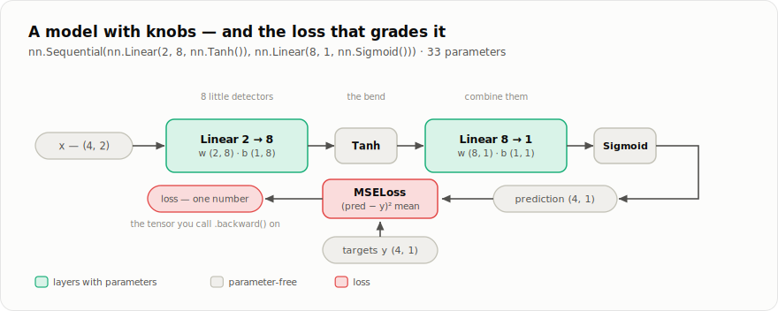

# Chapter 3 — Neural networks

*Part I, chapter 3 of 4. Autograd can differentiate anything we build
out of tensor operations. This chapter is about what to build: layers,
models, and the loss functions that give them something to learn.*

## A model is a function with knobs

Everything `babytorch.nn` produces is, mathematically, just

```
prediction = f(input, parameters)
```

— a tensor-to-tensor function with some **parameters**: tensors created
with `requires_grad=True`, which the optimizer will adjust. Chapter 2
guarantees that whatever `f` we compose, gradients for every parameter
come for free. So this chapter is really a catalogue of *useful shapes
of f*, from one workhorse layer to the pieces a GPT will need.

## The workhorse: `Linear`

The fundamental layer multiplies its input by a weight matrix and adds
a bias
([`babytorch/nn/nn.py`](../babytorch/nn/nn.py)):

```python
y = x @ W + b        # (batch, in) @ (in, out) + (1, out) -> (batch, out)
```

Each of the `out` output columns computes a weighted sum of all `in`
inputs — `out` little detectors, each free to weigh the input features
its own way. Note how naturally the batch flows through: `x` has one row
per example, `@` handles them all at once, and broadcasting (chapter 1)
gives every row the same bias.

```python
import babytorch.nn as nn

layer = nn.Linear(3, 5)      # in_features=3, out_features=5
layer.w.shape                # (3, 5)
layer.b.shape                # (1, 5)
```

One non-obvious detail: the weights start as *small random* numbers,
drawn from `U(-k, k)` with `k = 1/sqrt(in_features)`. Random — because
if all weights started equal, every detector would compute the same
thing and receive the same gradient, forever (nothing would ever make
them differ). Small, and scaled by the layer's width — so that outputs
have roughly the same variance as inputs, and signals neither explode
nor die as they pass through many layers. Getting initialization wrong
is one of the classic ways deep networks silently fail to train.

<details>
<summary><b>How it's implemented</b> — <code>babytorch/nn/nn.py</code> (the whole layer)</summary>

```python
    def __init__(self, in_features, out_features, activation_function=None):
        k = 1.0 / math.sqrt(in_features)
        self.w = Tensor(xp.random.uniform(-k, k, (in_features, out_features)),
                        requires_grad=True)
        self.b = Tensor(xp.random.uniform(-k, k, (1, out_features)),
                        requires_grad=True)
        self.activation_function = activation_function

    def forward(self, x):
        out = x @ self.w + self.b
        if self.activation_function:
            out = self.activation_function(out)
        return out
```

</details>

## Why we need non-linearities

Stack two linear layers and you get... a linear function:
`(x @ W1) @ W2 = x @ (W1 @ W2)`. The composition collapses. However
deep the stack, it could only ever draw straight decision lines.

The fix costs one line: squeeze a simple **non-linear** function between
the layers. BabyTorch provides the standard set, both as modules and as
tensor methods:

```
ReLU:  max(0, x)        cheap, sharp — the modern default
Tanh:  squash to (-1,1) smooth, classic
Sigmoid: squash to (0,1) turns a score into a probability
GELU:  smooth ReLU      what GPT uses (chapter 7)
```

With non-linearities between them, stacked linear layers can bend —
and a stack of bends can approximate any reasonable function. That is
the entire idea of a neural network:

```python
model = nn.Sequential(
    nn.Linear(2, 8, nn.ReLU()),    # BabyTorch: activation as optional 3rd arg
    nn.Linear(8, 1, nn.Sigmoid()),
)
```

```
 x ──► Linear(2→8) ──► ReLU ──► Linear(8→1) ──► Sigmoid ──► prediction
        8 detectors     bend      combine        to (0,1)
```

## `Module`: the one base class

Layers and whole models share a tiny base class, `Module`
([`babytorch/nn/nn.py`](../babytorch/nn/nn.py)). Writing a new one takes
two steps — store parameters as attributes, implement `forward`:

```python
class TinyModel(nn.Module):
    def __init__(self):
        self.layer1 = nn.Linear(2, 8)     # sub-module
        self.layer2 = nn.Linear(8, 1)

    def forward(self, x):
        return self.layer2(self.layer1(x).relu())

model = TinyModel()
model(x)                      # calling the model calls forward()
```

Everything else is inherited, and it all works by **walking the
attributes**:

* `model.parameters()` — recursively collects every
  `requires_grad=True` tensor from the module, its sub-modules, and any
  *lists* of sub-modules (that last case is how a Transformer's stack of
  blocks is found). No registration calls, no metaclass tricks.
* `model.zero_grad()` — resets all those `.grad`s (chapter 2 explained
  why they would otherwise accumulate across batches).
* `model.train()` / `model.eval()` — flips a `training` flag on every
  sub-module; layers like Dropout behave differently per mode.
* `model.save(path)` / `nn.Module.load(path, model)` — pickle the
  parameters (converted to CPU NumPy, so a GPU-trained model loads
  anywhere).
* `model.num_parameters()` — how many trainable numbers you own.

`Sequential`, used above, is itself seven lines of `Module`: it stores
the given layers in a list and `forward` feeds each one's output to the
next.

<details>
<summary><b>How it's implemented</b> — <code>babytorch/nn/nn.py</code> (the attribute walk, and the gradient reset)</summary>

```python
    def parameters(self):
        """Collect every trainable tensor in this module, recursively.

        We look through the instance's attributes for:
        * tensors with ``requires_grad=True``  -> parameters of this module;
        * sub-modules                          -> ask them for theirs;
        * lists/tuples of sub-modules          -> same (e.g. Sequential,
          or the list of blocks in a Transformer).
        """
        params = []
        for value in vars(self).values():
            if isinstance(value, Tensor):
                if value.requires_grad:
                    params.append(value)
            elif isinstance(value, Module):
                params.extend(value.parameters())
            elif isinstance(value, (list, tuple)):
                for item in value:
                    if isinstance(item, Module):
                        params.extend(item.parameters())
                    elif isinstance(item, Tensor) and item.requires_grad:
                        params.append(item)
        return params
    # ...
    def zero_grad(self):
        """Reset the gradients of all parameters.

        Call this after each optimizer step: ``backward()`` *accumulates*
        gradients, so leftovers from the previous batch would otherwise
        contaminate the next one.
        """
        for p in self.parameters():
            p.grad = None
```

</details>

## Losses: turning "wrong" into a number

Training needs a single scalar that says *how wrong* the model is —
the tensor we call `.backward()` on. Two losses cover most of deep
learning ([`babytorch/nn/loss.py`](../babytorch/nn/loss.py)):

### `MSELoss` — for regression (predicting numbers)

```
loss = mean( (prediction − target)² )
```

Squaring makes both directions of error positive and punishes large
misses much more than small ones.

### `CrossEntropyLoss` — for classification (choosing among classes)

The model emits one raw score per class (**logits**). Cross-entropy
converts scores to probabilities with softmax, then charges the model
`−log p` where `p` is the probability it gave the *correct* class:

```
confident & right:  p ≈ 1   ->  −log p ≈ 0      (barely charged)
unsure:             p ≈ 0.5 ->  −log p ≈ 0.7
confident & wrong:  p ≈ 0   ->  −log p → ∞      (severely charged)
```

```python
criterion = nn.CrossEntropyLoss()
loss = criterion(logits, targets)   # logits (batch, classes); targets: class ids
```

Internally it uses `log_softmax` — softmax and log fused via the
log-sum-exp trick, so huge or tiny logits cannot overflow. **Keep this
loss in mind:** a language model predicting the next token is exactly
this classification, with `num_classes = vocabulary size`. The loss that
trains BabyGPT in chapter 8 is this one, unchanged.

<details>
<summary><b>How it's implemented</b> — <code>babytorch/nn/loss.py</code></summary>

```python
    def forward(self, predictions, targets):
        assert isinstance(predictions, Tensor), "predictions must be a Tensor"

        # Targets may arrive as a Tensor, a list, or an array; index arrays
        # must be integers.
        if isinstance(targets, Tensor):
            targets = targets.data
        targets = xp.asarray(targets).astype(xp.int64)
        assert targets.ndim == 1, (
            f"targets must be a 1-D array of class ids, got shape {targets.shape}")
        n = targets.shape[0]

        log_probs = predictions.log_softmax(axis=-1)      # (n, num_classes)
        # Pick out, for every row, the log-probability of its true class.
        picked = log_probs[xp.arange(n), targets]          # (n,)
        return -picked.mean()
```

</details>

## The specialists

Four more layers, each explained fully when Part II needs it:

* **`Embedding(num, dim)`** — a learnable lookup table: integer id
  `i` → row `i`, a `dim`-long vector. The forward pass is just indexing;
  autograd's slice-backward scatters gradients onto the rows that were
  used. This is how tokens enter a language model (chapter 5).
* **`LayerNorm(features)`** — rescales each feature vector to zero
  mean and unit variance, then lets two learned parameters (`gamma`,
  `beta`) undo it where useful. The stabilizer that keeps deep
  Transformers trainable (chapter 7).
* **`Dropout(p)`** — during training only, randomly zeroes a fraction
  `p` of values (survivors are scaled up by `1/(1−p)`, so evaluation can
  be a no-op). Because any value can vanish, the network can't lean on
  one fragile pathway — a blunt but effective cure for overfitting.
* **`Conv2D` / `MaxPool2D` / `Flatten`** — the vision detour: slide
  learned filters over an image, downsample, flatten for a final linear
  layer. Not needed for GPT, but the MNIST tutorial uses them, and
  [`operations.py`](../babytorch/engine/operations.py) contains both a
  loop-by-loop readable convolution and the fast `im2col` version that
  turns convolution into one big matmul.

Prefer functions over layer objects? `babytorch.nn.functional` (usually
imported as `F`) offers `F.relu`, `F.softmax`, `F.cross_entropy`, ... —
the same math without constructing modules.



**Try it**

```python
>>> import babytorch, babytorch.nn as nn
>>> model = nn.Sequential(nn.Linear(2, 8, nn.Tanh()), nn.Linear(8, 1, nn.Sigmoid()))
>>> model.num_parameters()          # (2*8 + 8) + (8*1 + 1) = 33
33
>>> x = babytorch.randn(4, 2)       # a batch of 4 two-feature examples
>>> model(x).shape
(4, 1)
>>> for name, p in model.named_parameters():
...     print(name, p.shape)
layers.0.w (2, 8)
layers.0.b (1, 8)
layers.1.w (8, 1)
layers.1.b (1, 1)
```

The model exists and transforms inputs — but its weights are random, so
its predictions are noise. Making them *not* noise is chapter 4.

## Exercises

**Check yourself** (answers unfold):

**Q1.** How many parameters does `nn.Linear(128, 10)` own?

<details><summary>Answer</summary>

1290: a `(128, 10)` weight matrix plus a `(1, 10)` bias — 1280 + 10.

</details>

**Q2.** What can a stack of five `Linear` layers *without activations*
compute that a single `Linear` cannot?

<details><summary>Answer</summary>

Nothing. `(x @ W1) @ W2 = x @ (W1 @ W2)` — the stack collapses into one
matrix. Depth only pays once a non-linearity sits between the layers.

</details>

**Q3.** A classifier gives the correct class probability `p = 0.01`.
Roughly what does cross-entropy charge for that example, and what is
the lesson?

<details><summary>Answer</summary>

`−ln(0.01) ≈ 4.6` — versus ≈ 0.1 for a confident correct answer.
Cross-entropy punishes *confident wrongness* brutally, which is exactly
the pressure that makes the model calibrate its probabilities.

</details>

**Build it** — implement `RMSNorm` (the LLaMA norm — chapter 7's
LayerNorm slot, leaner) and ★ `bce_loss` in
[`exercises/ch03_nn.py`](exercises/ch03_nn.py), then run
`pytest book/exercises/test_ch03_nn.py -v`. Tensor ops only: if you
build it right, the backward pass is free.
([How the exercises work](exercises/README.md).)

---

**Source files for this chapter:**
[`babytorch/nn/nn.py`](../babytorch/nn/nn.py) (Module and all layers) ·
[`babytorch/nn/loss.py`](../babytorch/nn/loss.py) (losses) ·
[`babytorch/nn/functional.py`](../babytorch/nn/functional.py) (functional forms)

[← Chapter 2: Autograd](02-autograd.md) | [Contents](README.md) | [Chapter 4: Training →](04-training.md)
