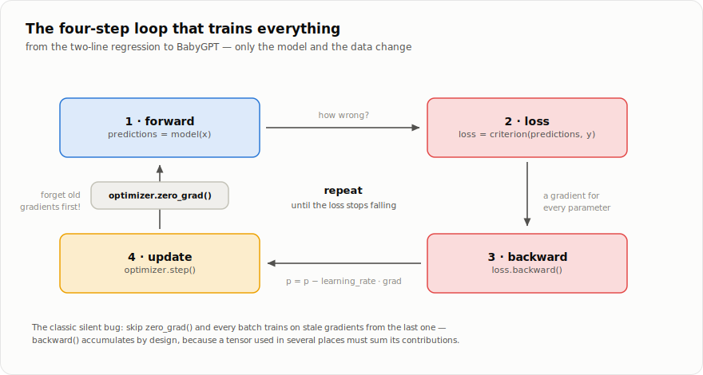

# Chapter 4 — Training

*Part I, chapter 4 of 4. We have models that compute and autograd that
differentiates. This chapter closes the loop — literally: the four-step
loop that turns random weights into a trained network, and the
optimizers that make it fast.*

## Learning goals

By the end of this chapter, you will be able to:

- write and diagnose the complete forward-loss-backward-update loop;
- distinguish full-batch, stochastic, and mini-batch gradient estimates;
- explain momentum, Adam, AdamW, and learning-rate scheduling; and
- use training and validation curves to recognize underfitting and overfitting.

## Gradient descent in one picture

After `loss.backward()`, every parameter holds `dLoss/dparameter` — the
direction in which the loss *increases*. So step the other way:

```
parameter  =  parameter  −  learning_rate × gradient
```

Do that for every parameter, re-measure the loss on fresh data, repeat.
Imagine standing on a foggy hillside where the loss is your altitude:
the gradient is the slope under your feet, and each update is one small
step downhill. You cannot see the valley — but you don't need to. Every
piece of deep learning training, up to and including GPTs, is this loop:

```python
for step in range(num_steps):
    predictions = model(x)               # 1. forward
    loss = criterion(predictions, y)     # 2. how wrong?
    optimizer.zero_grad()                #    (forget old gradients)
    loss.backward()                      # 3. gradients for every parameter
    optimizer.step()                     # 4. small step downhill
```



Why `zero_grad()` every time? Chapter 2: `backward()` **accumulates**
into `.grad` (it must — a parameter used twice sums its contributions).
Without the reset, batch 2 would inherit batch 1's gradients. Forgetting
this line is the classic beginner bug: training limps, nothing crashes.

## A complete example you can run

Fit a line to noisy data — the smallest possible "model":

```python
import babytorch
import babytorch.nn as nn
from babytorch.optim import SGD

babytorch.manual_seed(0)

# Data from a secret rule: y = 3x + 2, plus noise
x = babytorch.rand(100, 1) * 4.0 - 2.0
y = x * 3.0 + 2.0 + babytorch.randn(100, 1) * 0.3

model = nn.Linear(1, 1)                  # w and b start ~random
optimizer = SGD(model.parameters(), learning_rate=0.1)
criterion = nn.MSELoss()

for step in range(200):
    loss = criterion(model(x), y)
    optimizer.zero_grad()
    loss.backward()
    optimizer.step()
    if step % 50 == 0:
        print(f"step {step:3d}  loss {loss.item():.4f}")

print("w =", model.w.item(), " b =", model.b.item())   # ≈ 3 and ≈ 2
```

The model recovers the secret rule from examples alone. Every tutorial
in this repository — up to BabyGPT itself — is this program with a
bigger `model` and more interesting `(x, y)`.

## The learning rate: the one knob you must respect

That `learning_rate=0.1` controls the step size, and it is the most
consequential number in training:

```
too small ────────── just right ────────── too large
loss creeps down     loss falls fast,      loss oscillates,
imperceptibly        then settles          or explodes to NaN
```

There is no universal value — `0.1` suits a tiny regression, `3e-3`
suits BabyGPT, big Transformers use smaller still. When training
misbehaves, suspect the learning rate first.

## Mini-batches

Real datasets don't fit in one forward pass. Instead, each step uses a
random **mini-batch** (32 examples, say). The gradient becomes an
estimate of the full-dataset gradient — noisy, but so much cheaper that
taking many noisy steps beats taking few perfect ones (the noise even
helps escape bad regions). That is the "stochastic" in SGD.
[`DataLoader`](../babytorch/datasets/data_loader.py) handles the
shuffling and slicing:

```python
from babytorch.datasets import DataLoader
for x_batch, y_batch in DataLoader(dataset, batch_size=32, shuffle=True):
    ...one training step...
```

## Smarter steps: the optimizer family

All optimizers share one interface — `step()` and `zero_grad()` — and
live in [`babytorch/optim/optim.py`](../babytorch/optim/optim.py). Three
generations, each fixing a real problem:

**SGD** — the plain rule above. Two useful options:
*momentum* keeps a running velocity (`v = momentum·v + grad`) so
persistent directions build up speed and zig-zagging noise cancels out,
like a heavy ball rolling downhill; *weight_decay* constantly shrinks
weights toward zero (L2 regularization) to discourage extreme values.

**Adam** — SGD where every parameter tunes its *own* step size. It
tracks two running averages per parameter: `m`, the mean gradient
(which way is downhill?), and `v`, the mean *squared* gradient (how
large/noisy are the steps here?), then updates

```
p  =  p − learning_rate · m / (√v + ε)
```

Parameters with consistently huge gradients get relatively smaller
steps; rare-but-important ones get relatively larger. (The code also
divides by `1 − βᵗ` — *bias correction*, which un-biases the averages
that start at zero.) Adam is the sensible default for anything bigger
than a toy.

**AdamW** — Adam with weight decay *decoupled*: the shrink is applied
directly to the weights instead of being mixed into the gradient (where
Adam's per-parameter scaling would distort it). Regularizes better in
practice — this is what GPTs train with, including ours in chapter 8.

<details>
<summary><b>How it's implemented</b> — <code>babytorch/optim/optim.py</code> (SGD's step, then AdamW's)</summary>

```python
    def step(self):
        for i, p in enumerate(self.params):
            if p.grad is None:
                continue
            grad = p.grad
            if self.weight_decay > 0:
                grad = grad + self.weight_decay * p.data
            if self.momentum > 0:
                if self.velocities[i] is None:
                    self.velocities[i] = xp.zeros_like(p.data)
                self.velocities[i] = self.momentum * self.velocities[i] + grad
                grad = self.velocities[i]
            p.data -= self.learning_rate * grad
    # ...
    def step(self):
        for i, p in enumerate(self.params):
            if p.grad is None:
                continue
            self.steps[i] += 1
            t = self.steps[i]
            grad = p.grad

            self.m[i] = self.beta1 * self.m[i] + (1 - self.beta1) * grad
            self.v[i] = self.beta2 * self.v[i] + (1 - self.beta2) * grad * grad

            m_hat = self.m[i] / (1 - self.beta1 ** t)
            v_hat = self.v[i] / (1 - self.beta2 ** t)

            # Decoupled decay: shrink the weight directly...
            if self.weight_decay > 0:
                p.data -= self.learning_rate * self.weight_decay * p.data
            # ...then take the adaptive step.
            p.data -= self.learning_rate * m_hat / (xp.sqrt(v_hat) + self.eps)
```

</details>

## Learning-rate schedules

A rate that is right at step 0 is usually too big near the end — early
on you want bold strides across the landscape, later you want careful
settling into the valley. **Schedulers**
([`babytorch/optim/lr_scheduler.py`](../babytorch/optim/lr_scheduler.py))
adjust `optimizer.learning_rate` over time; call `scheduler.step(t)`
each iteration or epoch. `StepLR` (drop by 10× every N epochs) and
`LambdaLR` (any function you like) cover classic training; the one GPTs
use is **`CosineWarmupLR`**:

```
lr │        ╭──╮
   │      ╱      ╲
   │    ╱           ╲
   │  ╱                ╲──
   │╱                       ╲────────
   └────────────────────────────────► step
    warmup:        cosine decay:
    ramp 0 → lr    smooth glide to min_lr
```

The warmup matters because Adam's running averages are garbage for the
first few dozen steps — small steps until its statistics stabilize, then
full speed, then a smooth cosine descent.

<details>
<summary><b>How it's implemented</b> — <code>babytorch/optim/lr_scheduler.py</code></summary>

```python
    def __init__(self, optimizer, warmup_steps, total_steps, min_lr=0.0):
        super().__init__(optimizer)
        if not 0 <= warmup_steps < total_steps:
            raise ValueError("Expected 0 <= warmup_steps < total_steps.")
        if not 0 <= min_lr <= self.base_lr:
            raise ValueError("min_lr must be between 0 and the optimizer's learning rate.")
        self.warmup_steps = warmup_steps
        self.total_steps = total_steps
        self.min_lr = min_lr

    def step(self, t):
        if t < self.warmup_steps:
            lr = self.base_lr * (t + 1) / self.warmup_steps
        elif t >= self.total_steps:
            lr = self.min_lr
        else:
            progress = (t - self.warmup_steps) / (self.total_steps - self.warmup_steps)
            cosine = 0.5 * (1.0 + math.cos(math.pi * progress))   # 1 -> 0
            lr = self.min_lr + (self.base_lr - self.min_lr) * cosine
        self.optimizer.learning_rate = lr
```

</details>

## Did it actually learn? Train vs. validation

A model can ace the questions it trained on by *memorizing* them —
impressive-looking loss, useless model. So we always hold some data out:

```
train loss ↓, val loss ↓        learning         keep going
train loss ↓, val loss ↑        overfitting      stop / regularize
train loss stuck high           underfitting     bigger model, higher lr,
                                                 or a bug (check zero_grad!)
```

The gap between the curves is the model's honesty. Remedies for
overfitting, in the order to try them: more data, `Dropout`,
`weight_decay`, a smaller model. You will see the split used in
chapter 8, where BabyGPT holds out 10% of Shakespeare and prints both
losses every 100 steps.

For watching runs, `babytorch.Grapher`
([`babytorch/visualization/grapher.py`](../babytorch/visualization/grapher.py))
plots loss curves (`plot_loss`) — and, more unusually, draws the actual
computation graph of any tensor (`show_graph`), rendering chapter 2's
diagrams for real from the recorded `operation` links.

**Try it** — the classic non-linear test, XOR. A single linear layer
provably cannot solve it; with one hidden layer and a bend, gradient
descent finds a solution in seconds:

```python
import babytorch, babytorch.nn as nn
from babytorch.optim import SGD

babytorch.manual_seed(1)
X = babytorch.tensor([[0.,0.],[0.,1.],[1.,0.],[1.,1.]])
Y = babytorch.tensor([[0.],[1.],[1.],[0.]])         # XOR truth table

model = nn.Sequential(nn.Linear(2, 8, nn.Tanh()),
                      nn.Linear(8, 1, nn.Sigmoid()))
optimizer = SGD(model.parameters(), learning_rate=0.5)
criterion = nn.MSELoss()

for step in range(2000):
    loss = criterion(model(X), Y)
    optimizer.zero_grad()
    loss.backward()
    optimizer.step()

print(model(X).data.round().T)    # [[0. 1. 1. 0.]] — XOR, learned
```

For larger worked examples, see
[`tutorials/regression`](../tutorials/regression) and
[`tutorials/classification`](../tutorials/classification) (up to MNIST
digits with convolutions), and
[`tests/test_training.py`](../tests/test_training.py) — the end-to-end
proofs that this loop works, including a tiny GPT.

## Key takeaways

- Training repeatedly measures a scalar loss, differentiates it, and updates
  parameters in the direction expected to reduce future loss.
- Optimizers change the update rule, while schedules change its scale over
  time; neither replaces the need for a sound objective and representative data.
- Validation data estimates generalization and must remain outside parameter
  updates; repeated tuning against it can still overfit the development process.

## Exercises

**Check yourself** (answers unfold):

**Q1.** Spot the bug:

```python
for step in range(1000):
    loss = criterion(model(x), y)
    loss.backward()
    optimizer.step()
```

<details><summary>Answer</summary>

No `zero_grad()`. Every `backward()` **adds** to the existing `.grad`,
so by step 100 the model is stepping along the sum of 100 stale
gradients. Nothing crashes — the loss just stalls or oscillates, which
is what makes this the classic silent bug.

</details>

**Q2.** The loss falls nicely for 300 steps, then suddenly reads `nan`.
Which knob do you suspect first, and what is the standard seatbelt?

<details><summary>Answer</summary>

The learning rate — too large a step overshot into a region of huge
gradients and the updates exploded. Lower it; and clip the gradient
norm (you'll build `clip_grad_norm_` in this chapter's exercises) so
one unlucky batch can't catapult the weights.

</details>

**Q3.** Training loss keeps falling; validation loss has turned upward.
Name the condition and two remedies.

<details><summary>Answer</summary>

Overfitting — the model is memorizing the training set. Remedies, in
the order to try: more data, `Dropout` / `weight_decay`, a smaller
model, or simply stopping at the validation minimum (early stopping).

</details>

**Build it** — implement `clip_grad_norm_` and ★ a full `RMSProp`
optimizer (the missing link between SGD and Adam) in
[`exercises/ch04_training.py`](exercises/ch04_training.py), then run
`pytest book/exercises/test_ch04_training.py -v`.
([How the exercises work](exercises/README.md).)

---

**Part I is complete.** You now know the whole machine: tensors carry
data (ch. 1), autograd differentiates anything built from them (ch. 2),
modules organize parameters into models (ch. 3), and the training loop
improves them (ch. 4). Nothing in Part II adds machinery — a GPT is
*just another `Module`* trained by *exactly this loop*. What Part II
adds are ideas: how text becomes tensors, and the architecture that
turned next-token prediction into the technology behind ChatGPT.

**Source files for this chapter:**
[`babytorch/optim/optim.py`](../babytorch/optim/optim.py) ·
[`babytorch/optim/lr_scheduler.py`](../babytorch/optim/lr_scheduler.py) ·
[`babytorch/datasets/data_loader.py`](../babytorch/datasets/data_loader.py) ·
[`babytorch/visualization/grapher.py`](../babytorch/visualization/grapher.py)

[← Chapter 3: Neural networks](03-neural-networks.md) | [Contents](README.md) | [Part II — Chapter 5: Tokenization →](05-tokenization.md)
