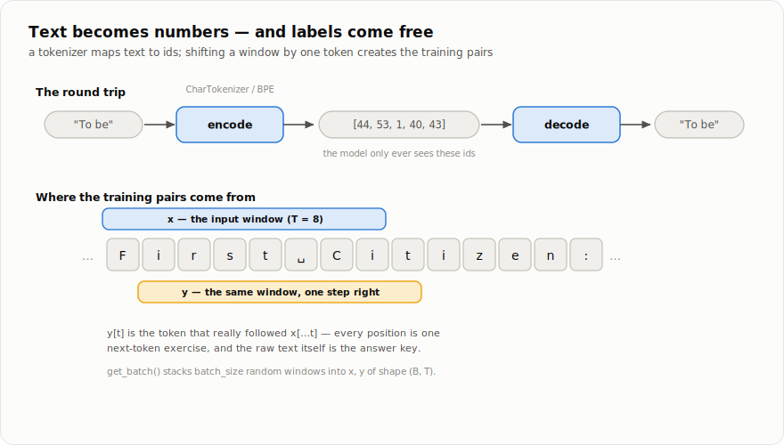

# Chapter 5 — Tokenization

*Part II, chapter 1 of 4. Part I built a complete learning machine.
Part II points it at language. First problem: neural networks eat
numbers, and we have text.*

## What a language model actually does

Strip away the mystique and a language model is a classifier from
chapter 3: given the text so far, **predict the next piece of text**.

```
input:  "To be, or not to b"      ->  model  ->  "e"  (probably)
```

One prediction is unimpressive. The trick is *iteration*: append the
predicted piece, predict again, and again — and the model writes
(chapter 8). Every capability of GPT-style models is trained through
this one objective: get better at guessing what comes next.

But a classifier needs a fixed set of classes to choose among, and
numeric inputs. So before any modelling we must decide: what are the
*pieces* of text? That decision is called **tokenization**, and it fixes
the model's vocabulary — the alphabet of everything it will ever read
or say:

```
   text ──encode──►  [18, 47, 32, 1]  ──model──►  [32]  ──decode──►  text
              (token ids: plain integers)
```

Both tokenizers below live in
[`babytorch/text/tokenizers.py`](../babytorch/text/tokenizers.py), and
both are two-way maps between strings and integer ids.

## The simplest answer: one token per character

`CharTokenizer` scans a corpus, collects every distinct character, and
numbers them alphabetically:

```python
>>> from babytorch.text import CharTokenizer
>>> tok = CharTokenizer("hello world")
>>> tok.chars                      # the whole vocabulary
[' ', 'd', 'e', 'h', 'l', 'o', 'r', 'w']
>>> tok.vocab_size
8
>>> tok.encode("low")
[4, 5, 7]
>>> tok.decode([4, 5, 7])
'low'
```

Character-level tokenization is honest and tiny — Tiny Shakespeare
needs only ~65 tokens — and it is what BabyGPT uses, because it makes
every part of the pipeline transparent: nothing is hidden inside the
tokens. The cost: sequences get long (one token per letter), and the
model must burn capacity learning to *spell* before it can learn to
*write*.

<details>
<summary><b>How it's implemented</b> — <code>babytorch/text/tokenizers.py</code> (the whole tokenizer, essentially)</summary>

```python
    def fit(self, text):
        """Build the vocabulary from all characters seen in ``text``."""
        self.chars = sorted(set(text))
        self.stoi = {ch: i for i, ch in enumerate(self.chars)}   # string -> int
        self.itos = {i: ch for i, ch in enumerate(self.chars)}   # int -> string
        return self

    @property
    def vocab_size(self):
        return len(self.chars)

    def encode(self, text):
        """Text -> list of integer ids."""
        return [self.stoi[ch] for ch in text]

    def decode(self, ids):
        """List of ids -> text."""
        return ''.join(self.itos[int(i)] for i in ids)
```

</details>

The opposite extreme, one token per **word**, has the mirror problem: a
vocabulary of hundreds of thousands, an embedding row for each, and
total blindness to any word not seen in training (`"untokenizable"` →
`???`).

## The GPT answer: Byte Pair Encoding

BPE finds the middle ground automatically: **let the corpus itself
decide what the pieces are.** Frequent sequences deserve their own
token; rare ones can stay split into parts. The training algorithm is
four lines of English:

1. Start with the vocabulary = individual characters.
2. Count every adjacent pair of tokens in the corpus.
3. Merge the most frequent pair into one new token.
4. Repeat until the vocabulary reaches the target size.

Watch it run on a six-word corpus (real output from `BPETokenizer`):

```python
>>> from babytorch.text import BPETokenizer
>>> tok = BPETokenizer().fit("low lower lowest new newer newest",
...                          vocab_size=20)
>>> list(tok.merges.items())[:5]        # the first learned merge rules
[(('w', 'e'), 'we'),        # "we" occurs in lower/lowest/newer/newest...
 (('l', 'o'), 'lo'),        # ...so it merges first; then "lo",
 (('n', 'e'), 'ne'),        # then "ne",
 (('w', '</w>'), 'w</w>'),
 (('lo', 'we'), 'lowe')]    # merges of merges: pieces grow
>>> tok.encode("lowest")
[13, 16]
>>> [tok.inverse_vocab[i] for i in tok.encode("lowest")]
['lowe', 'st</w>']          # two subwords, not six characters
```

Two details worth noticing:

* **`</w>` is an end-of-word marker** appended to every word before
  training. It lets the vocabulary distinguish "low at the end of a
  word" from "low inside *lowest*", and it stops merges from gluing
  separate words together. When decoding, `</w>` becomes a space.
* **Encoding = replaying the merges.** To tokenize new text, split it
  into characters and apply the learned merge rules in the order they
  were learned. Common words collapse into single tokens; a rare word
  degrades gracefully into subword pieces — never into `???`.

This is genuinely the algorithm behind GPT-2/3/4's tokenizers (theirs
start from *bytes* rather than characters and add heavy optimization,
but the merge loop is the same). The `vocab_size` knob trades sequence
length against vocabulary size; production models settle around
50,000–100,000 tokens.

<details>
<summary><b>How it's implemented</b> — <code>babytorch/text/tokenizers.py</code> (the merge loop, and encoding by replay)</summary>

```python
    def fit(self, text, vocab_size=512, verbose=False):
        """Learn merge rules from ``text`` up to ``vocab_size`` tokens.

        A special end-of-word marker ``</w>`` is appended to each word so
        the model can tell where words end (and doesn't merge across
        spaces).
        """
        # Represent each unique word as space-separated characters + </w>.
        words = text.split()
        sequences = Counter(' '.join(list(w) + ['</w>']) for w in words)

        # Seed the vocabulary with the base characters.
        base = set()
        for seq in sequences:
            base.update(seq.split())
        vocab = sorted(base)

        while len(vocab) < vocab_size:
            pair_counts = self._get_pair_counts(sequences)
            if not pair_counts:
                break
            best = max(pair_counts, key=pair_counts.get)
            sequences = self._merge_pair(best, sequences)
            self.merges[best] = ''.join(best)
            merged = ''.join(best)
            if merged not in vocab:
                vocab.append(merged)
    # ...
    def _tokenize_word(self, word):
        """Apply the learned merges to one word, return its sub-tokens."""
        symbols = list(word) + ['</w>']
        # Replay merges in the order they were learned (dict preserves it).
        for pair, merged in self.merges.items():
            i = 0
            while i < len(symbols) - 1:
                if symbols[i] == pair[0] and symbols[i + 1] == pair[1]:
                    symbols[i:i + 2] = [merged]
                else:
                    i += 1
        return symbols
```

</details>

## From tokens to training pairs — labels for free

A tokenized corpus is one long array of ids:

```python
data = np.array(tokenizer.encode(text))     # e.g. 1,115,394 ids for Shakespeare
```

Now the beautiful part. Chapter 3's classifiers needed hand-made labels.
Next-token prediction gets them **from the raw text itself**: the label
for any position is simply the token that actually came next. Cut a
window of `block_size` tokens for the input `x`, and the same window
shifted one step right for the target `y`:



One window of length `T` yields `T` prediction exercises at once —
position 0 predicts from 1 token of context, position 1 from 2 tokens,
and so on. `get_batch` in
[`tutorials/llm/common.py`](../tutorials/llm/common.py) does exactly
this: pick `batch_size` random offsets, stack the windows into an
`x, y` pair of shape `(B, T)`.

<details>
<summary><b>How it's implemented</b> — <code>tutorials/llm/common.py</code></summary>

```python
def get_batch(data, block_size, batch_size):
    """Sample a random mini-batch of (context, next-token) pairs.

    We pick ``batch_size`` random start positions and cut ``block_size``
    tokens for the input ``x`` and the same window shifted one step to the
    right for the target ``y`` -- so ``y[t]`` is the token that really
    followed ``x[t]``.  Language modelling is next-token prediction, and
    this is where the "next token" labels come from, for free, from raw
    text.
    """
    ix = np.random.randint(0, len(data) - block_size - 1, size=batch_size)
    x = np.stack([data[i:i + block_size] for i in ix])
    y = np.stack([data[i + 1:i + 1 + block_size] for i in ix])
    return x, y
```

</details>

This is **self-supervision**, and it is the reason language models
could grow so large: every scrap of text on Earth is pre-labelled
training data for the objective "guess the next token". No annotators
required.

So text is now integer tensors, with targets. But an integer id is a
meaningless name — id 13 is not "more than" id 12. The model's first
move will be to swap each id for a learned *vector* that can carry
meaning (chapter 3's `Embedding`). What happens after that — how
position 7 gets to consult positions 0–6 before making its guess — is
the architecture that changed everything.

---

**Source files for this chapter:**
[`babytorch/text/tokenizers.py`](../babytorch/text/tokenizers.py) (both tokenizers) ·
[`babytorch/datasets/text.py`](../babytorch/datasets/text.py) (Tiny Shakespeare) ·
[`tutorials/llm/common.py`](../tutorials/llm/common.py) (`get_batch`) ·
[`tests/test_tokenizer.py`](../tests/test_tokenizer.py)

[← Chapter 4: Training](04-training.md) | [Contents](README.md) | [Chapter 6: Attention →](06-attention.md)
