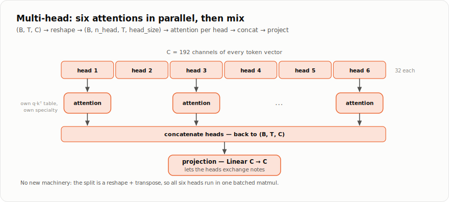

# Chapter 6 — Attention

*Part II, chapter 2 of 4. One mechanism separates the Transformer from
everything that came before. This chapter builds it: self-attention,
the reason a token can look back at its whole context and decide, for
itself, what matters.*

## Setting the stage: ids become vectors

Chapter 5 left us with batches of token ids, shape `(B, T)` — `B`
sequences of `T` tokens each. Ids enter the model through two
`Embedding` tables (chapter 3) and become vectors:

```python
tok = self.token_embedding(idx)              # (B, T, C): what each token IS
pos = self.position_embedding(xp.arange(T))  # (T, C):    where each token SITS
x = tok + pos                                # broadcast add -> (B, T, C)
```

`C` (`n_embd`) is the model's working width — every token is now a
`C`-dimensional vector that will be read, mixed and rewritten as it
flows through the model. The **position embedding** looks odd until you
know a secret about what follows: attention by itself is completely
blind to order. It treats its input as a *set* of vectors. Adding a
learned "I am position 3" vector to each token is what lets the model
distinguish "dog bites man" from "man bites dog".

## The problem

Consider predicting the next word here:

```
"The cat, which had been sleeping on the warm windowsill, suddenly ___"
```

Whatever fills the blank should agree with **cat** — thirteen tokens
back. Some blanks need the previous word, some need a name from three
sentences ago. A layer with *fixed* weights (Linear, or a convolution's
fixed window) always mixes the same positions in the same proportions.
What we need is a layer where **the mixing weights are computed from
the content, on the fly** — where "suddenly" can decide, this time, to
listen to "cat".

That layer is self-attention.

## Queries, keys, values

Attention gives every position three vectors, each a learned linear
projection of that position's current vector `x[t]`:

* **query** `q[t]` — *what am I looking for?*
* **key** `k[t]` — *what do I contain / offer?*
* **value** `v[t]` — *if you attend to me, this is what you receive.*

Think of a library: your query is the topic you walk in with, each
book's key is its spine label, and its value is what's actually printed
inside. You compare your query against all spines, and read most from
the best matches.

The comparison is a dot product — large when two vectors point the same
way. Scores are computed between every query and every key **in one
matrix multiplication**, then softmax (chapter 2) turns each row of
scores into mixing weights that sum to 1, and those weights blend the
values:

```
scores = q @ kᵀ / √head_size          # (T, T): how much i wants j
weights = softmax(scores, axis=-1)    # each row: a probability mix
output  = weights @ v                 # blend of values, one per position
```

Concretely, one row of `weights` might look like:

```
                    keys:  The   cat   sat   on   the   mat
query from "suddenly":   [ 0.03  0.61  0.08  0.02  0.05  0.21 ]
                                  ▲
                     it decided, from content alone, to read "cat"
```

The output at that position is `0.61·v(cat) + 0.21·v(mat) + ...` — a
fresh vector, mostly made of what "cat" offered. Different sentence,
different weights: this is dynamic routing of information, and it is
learned end-to-end (the projections that make q, k, v are just weight
matrices; autograd trains them like everything else).

**Why divide by √head_size?** Dot products of longer vectors are
bigger. Left unscaled, scores grow with the vector width, softmax
saturates into a one-hot spike, and the gradient through it dies
(chapter 2's softmax backward: nearly-certain distributions barely
move). Dividing by `√head_size` keeps scores at a size where softmax
stays soft and trainable.

## The causal mask: no reading ahead

We are training a *next-token predictor*. If position 3 could attend to
position 4, it could just copy the answer it is supposed to predict —
perfect training loss, useless model. So, before the softmax, we forbid
looking forward by adding a **mask**: 0 on allowed pairs, −10⁹ where
`j > i`:

```
            keys j:  0    1    2    3
query i=0        [   0   -1e9 -1e9 -1e9 ]      each row may see
      i=1        [   0    0   -1e9 -1e9 ]      itself and the past,
      i=2        [   0    0    0   -1e9 ]      never the future
      i=3        [   0    0    0    0   ]
```

After softmax, `e^(−10⁹)` is zero: future positions get exactly no
weight. This one triangular matrix is the entire difference between a
GPT-style (decoder-only) model and a bidirectional one like BERT — and
it is why generation (chapter 8) works: the model was never allowed to
rely on information it won't have.

<details>
<summary><b>How it's implemented</b> — <code>tutorials/llm/model.py</code> (the mask is built once, as a constant)</summary>

```python
    def __init__(self, n_embd, n_head, block_size, dropout=0.0):
        assert n_embd % n_head == 0, "n_embd must be divisible by n_head"
        self.n_head = n_head
        self.head_size = n_embd // n_head

        # One linear layer produces query, key and value together (3 * n_embd),
        # which we split apart after -- cheaper than three separate layers.
        self.qkv = nn.Linear(n_embd, 3 * n_embd)
        self.proj = nn.Linear(n_embd, n_embd)  # mixes the heads back together
        self.attn_dropout = nn.Dropout(dropout)
        self.resid_dropout = nn.Dropout(dropout)

        # A constant (T, T) matrix: 0 where attention is allowed, a large
        # negative number where it is forbidden (the future).  Added to the
        # scores before softmax, the -1e9 entries become ~0 probability.
        mask = xp.triu(xp.full((block_size, block_size), -1e9), k=1)
        self.mask = Tensor(mask)  # not a parameter: requires_grad is False
```

</details>

Here is the whole head at a glance — projections, masked score
triangle, and the value read-out:


## Many heads at once

One attention pattern per layer is a bottleneck: the same weights that
track subject–verb agreement would also have to track quotation marks
and rhyme. **Multi-head attention** runs `n_head` attentions in
parallel, each in its own `head_size = C / n_head`-dimensional slice of
the channels, free to specialize; their outputs are concatenated and
mixed by a final projection.



No new machinery is needed — just chapter 1's reshaping, so all heads
compute in one batched matmul. Follow the shapes in the real code,
[`tutorials/llm/model.py`](../tutorials/llm/model.py):

```python
def forward(self, x):
    B, T, C = x.shape

    qkv = self.qkv(x)              # one Linear makes q,k,v: (B, T, 3C)
    q = qkv[:, :, :C]              # split into three (B, T, C) tensors
    k = qkv[:, :, C:2*C]
    v = qkv[:, :, 2*C:]

    # carve C into heads:  (B, T, C) -> (B, n_head, T, head_size)
    q = q.reshape(B, T, self.n_head, self.head_size).transpose((0, 2, 1, 3))
    k = k.reshape(B, T, self.n_head, self.head_size).transpose((0, 2, 1, 3))
    v = v.reshape(B, T, self.n_head, self.head_size).transpose((0, 2, 1, 3))

    # scores for every pair of positions, all heads at once
    att = (q @ k.transpose((0, 1, 3, 2))) * (1.0 / math.sqrt(self.head_size))
    att = att + self.mask[:T, :T]      # forbid the future
    att = att.softmax(axis=-1)         # scores -> mixing weights
    att = self.attn_dropout(att)

    y = att @ v                                     # read the values
    y = y.transpose((0, 2, 1, 3)).reshape(B, T, C)  # glue heads back
    return self.resid_dropout(self.proj(y))         # final mix
```

The shape story, line by line:

| tensor | shape | meaning |
|--------|-------|---------|
| `x` | `(B, T, C)` | one vector per position |
| `q`, `k`, `v` | `(B, nh, T, hs)` | the same, carved into `nh` heads |
| `att` | `(B, nh, T, T)` | every head's full who-attends-to-whom table |
| `att @ v` | `(B, nh, T, hs)` | what each position read, per head |
| `y` | `(B, T, C)` | heads concatenated, projected — ready for the next layer |

Two small notes on the code. The `qkv` layer computes all three
projections as one `Linear(C, 3C)` — one matmul instead of three,
identical math. And `self.mask` is created once, from `xp.triu`, as a
plain constant tensor (`requires_grad=False`): the mask is a rule of
the game, not something to learn.

## The punchline

Look back at the forward pass: it is nothing but `Linear`, `reshape`,
`transpose`, `@`, `+`, `softmax`, `Dropout` — every one an operation
from Part I. There is no `AttentionGradient` anywhere in BabyTorch.
When chapter 8 calls `loss.backward()`, chapter 2's machinery
differentiates attention like any other expression: the matmul rule
flows gradients through `att @ v`, the softmax rule redistributes them
across the mixing weights, `sum_to_shape` handles the broadcasts.
Attention is a big idea, but it is *not* a new primitive.

Attention lets positions **communicate**. What each position does with
the information it gathered — and how these layers stack into a
twelve-story building that stays trainable — is chapter 7.

## Exercises

**Check yourself** (answers unfold):

**Q1.** With `T = 5`, how many of the 25 attention scores survive the
causal mask?

<details><summary>Answer</summary>

15 — the lower triangle including the diagonal, `T(T+1)/2`. Each
position sees itself and its past: 1 + 2 + 3 + 4 + 5.

</details>

**Q2.** Delete the `/ √head_size` scaling. What goes wrong, and through
which mechanism?

<details><summary>Answer</summary>

Dot products grow with vector length, so scores get large, softmax
saturates toward one-hot — and chapter 2's softmax backward shows the
gradient of a nearly-certain distribution is nearly zero. Attention
stops learning *which* positions to attend to.

</details>

**Q3.** Why must `n_head` divide `n_embd`?

<details><summary>Answer</summary>

The heads are made by *carving* the C channels into equal slices of
`head_size = C / n_head` with a reshape — no new numbers are created,
the same C channels are just viewed as `n_head` groups. Unequal slices
wouldn't reshape.

</details>

**Build it** — write `causal_attention` from raw tensor ops (the grader
includes the property that defines causality: *rewriting the future
must not change the past's outputs*), and ★ the `split_heads` /
`merge_heads` reshape pair, in
[`exercises/ch06_attention.py`](exercises/ch06_attention.py); then run
`pytest book/exercises/test_ch06_attention.py -v`.
([How the exercises work](exercises/README.md).)

---

**Source files for this chapter:**
[`tutorials/llm/model.py`](../tutorials/llm/model.py) (`CausalSelfAttention`) ·
[`babytorch/nn/nn.py`](../babytorch/nn/nn.py) (`Embedding`, `Linear`, `Dropout`) ·
[`babytorch/engine/operations.py`](../babytorch/engine/operations.py) (`MatMulOperation`, `SoftmaxOperation`)

[← Chapter 5: Tokenization](05-tokenization.md) | [Contents](README.md) | [Chapter 7: The Transformer →](07-transformer.md)
