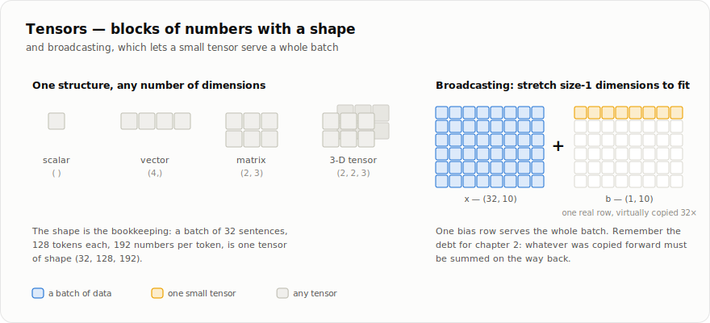

# الفصل 1 — التنسورات

*الجزء الأول، الفصل 1 من 4. في التعلّم العميق، كل شيء تقريبًا يتحول إلى أرقام:
الصور، الجمل، أوزان النموذج، وحتى التدرجات. هذه الأرقام نضعها في بنية واحدة اسمها
التنسور. هذا الفصل يشرح هذه البنية ببساطة.*

## الفكرة الأساسية: أرقام لها شكل

التنسور (Tensor) هو مصفوفة متعددة الأبعاد. يمكنك أن تفكر فيه ككتلة من الأرقام، ومعها
معلومة مهمة جدًا: **الشكل** (shape). الشكل يخبرنا كيف نقرأ هذه الأرقام.



لماذا لا نستخدم قوائم بايثون العادية بدلًا من ذلك؟ لسببين رئيسيين:

1. **الشكل يحمل المعنى.** تخيل دفعة فيها 32 جملة، كل جملة طولها 128 رمزًا،
   وكل رمز ممثل بمتجه طوله 192 رقمًا. هذا كله تنسور شكله `(32, 128, 192)`.
   الشكل هنا ليس تفصيلًا جانبيًا؛ هو الذي يقول لنا إن البعد الأول هو عدد الجمل،
   والثاني هو عدد الرموز، والثالث هو حجم تمثيل كل رمز.
2. **السرعة تأتي من العمل على الكتلة كلها.** عندما تكون الأرقام في كتلة ذاكرة واحدة،
   تستطيع مكتبة المصفوفات تنفيذ العملية كلها دفعة واحدة بكود سريع مكتوب بلغة منخفضة
   المستوى، أو بنواة GPU. لذلك القاعدة الذهبية في برمجة المصفوفات هي:
   *لا تلف على العناصر واحدًا واحدًا في بايثون؛ اكتب العملية على التنسور كله.*

## إنشاء التنسورات

يشبه BabyTorch دوال إنشاء التنسورات في PyTorch
([`babytorch/__init__.py`](../../babytorch/__init__.py)):

```python
import babytorch

a = babytorch.tensor([[1., 2., 3.], [4., 5., 6.]])  # from data
z = babytorch.zeros(2, 3)         # all zeros
o = babytorch.ones(2, 3)          # all ones
r = babytorch.randn(2, 3)         # random, normal distribution (mean 0, std 1)
u = babytorch.rand(2, 3)          # random, uniform in [0, 1)
n = babytorch.arange(0, 10, 2)    # 0, 2, 4, 6, 8

babytorch.manual_seed(42)         # make the random ones reproducible
```

يستخدم BabyTorch النوع `float32` افتراضيًا في دوال الإنشاء. هذا هو النوع الشائع في
أمثلة هذا الكتاب: يستهلك نصف ذاكرة `float64`، ويكون أسرع على كثير من مسرّعات
التدريب. لكن مقدار التسارع والدقة المقبولة يعتمدان على العتاد والعملية والنموذج.
ويتعامل PyTorch مع الأنواع بتفصيل أكبر؛ فمثلًا يُبقي `torch.arange(0, 10, 2)`
الأعداد صحيحة، بينما يحوّلها `babytorch.arange` إلى `float32`.

**جرّبه**

```python
>>> import babytorch
>>> t = babytorch.tensor([[1., 2., 3.], [4., 5., 6.]])
>>> t.shape
(2, 3)
>>> t.ndim        # how many dimensions
2
>>> t.size        # how many numbers in total
6
>>> t.sum().item()   # .item() unwraps a single-element tensor to a Python number
21.0
```

## إعادة التشكيل: الأرقام نفسها، لكن بترتيب مختلف

يمكنك إعادة تنظيم الأرقام نفسها في شكل جديد. غالبًا لا ننسخ البيانات؛ نغير فقط طريقة
قراءتها:

```python
x = babytorch.arange(6)      # shape (6,):    [0 1 2 3 4 5]
x.reshape(2, 3)              # shape (2, 3):  [[0 1 2] [3 4 5]]
x.reshape(3, 2)              # shape (3, 2):  [[0 1] [2 3] [4 5]]

m = babytorch.randn(2, 3)
m.T                          # transpose: shape (3, 2), rows <-> columns
m.unsqueeze(0)               # insert a size-1 axis:  (2, 3) -> (1, 2, 3)
m.unsqueeze(0).squeeze()     # remove size-1 axes:    (1, 2, 3) -> (2, 3)
```

قد تبدو هذه العمليات شكلية الآن، لكنها ستصبح مهمة جدًا لاحقًا. في الفصل 6 مثلًا،
سنقسم تنسورًا شكله `(B, T, C)` إلى عدة رؤوس انتباه باستخدام `reshape` و`transpose`
فقط.

## العمليات الحسابية على التنسور كله

العمليات العادية مثل الجمع والضرب تطبق **عنصرًا بعنصر**:

```python
a = babytorch.tensor([1., 2., 3.])
b = babytorch.tensor([10., 20., 30.])
(a + b).data      # [11. 22. 33.]
(a * b).data      # [10. 40. 90.]  (element-wise, NOT matrix product)
(a ** 2).data     # [1. 4. 9.]
```

أما العامل `@` فهو **ضرب مصفوفات** حقيقي: صفوف تضرب في أعمدة. هذه العملية من أهم
عمليات التعلّم العميق؛ نماذج GPT تقضي معظم وقتها داخل عمليات شبيهة بـ `@`:

```
        (2, 3)      @      (3, 4)      ->      (2, 4)
     [[. . .]           [[. . . .]           [[. . . .]
      [. . .]]           [. . . .]            [. . . .]]
                         [. . . .]]
          └── inner dimensions must match ──┘
              (3 columns) dot (3 rows)
```

```python
a = babytorch.randn(2, 3)
w = babytorch.randn(3, 4)
(a @ w).shape     # (2, 4)
```

هناك أيضًا عمليات تختصر الأبعاد، مثل `t.sum()` و`t.mean()` و`t.max()` و`t.var()`.
يمكن أن تعمل على كل التنسور، أو على محور واحد. مثلًا `t.sum(axis=0)` يجمع على محور
الصفوف ويزيله من الشكل.

## البث: تنسور صغير يتمدد ليلائم تنسورًا أكبر

أحيانًا نريد جمع تنسورين بأشكال مختلفة. هنا يأتي مفهوم **البث** (broadcasting):
المكتبة لا تنسخ الأرقام فعليًا في الذاكرة، لكنها تتعامل مع الأبعاد ذات الحجم 1 وكأنها
مكررة حتى تتوافق الأشكال.

```
      x: (32, 10)      +      b: (1, 10)

      [[..........]           [[----------]     <- the same row,
       [..........]    +       [----------]        virtually repeated
           ...                     ...             32 times
       [..........]]           [----------]]
```

```python
x = babytorch.randn(32, 10)   # a batch of 32 examples
b = babytorch.ones(1, 10)     # ONE bias row
y = x + b                     # b is stretched across all 32 rows
y.shape                       # (32, 10)
```

بهذه الطريقة يمكن لمتجه انحياز واحد أن يخدم دفعة كاملة. والقاعدة البسيطة هي:
نقارن الأشكال من اليمين. بُعدان يكونان متوافقين إذا كانا متساويين، أو إذا كان أحدهما
يساوي 1. أما الأبعاد المفقودة من اليسار فنتعامل معها كأنها 1.

تذكر هذه الفكرة جيدًا؛ ستعود في الفصل 2. ما تم “تكراره” في التمرير الأمامي يجب أن
يتم “جمعه” في التمرير الخلفي.

## الكود نفسه على CPU وGPU

لا يكتب BabyTorch كلمة `numpy` مباشرة في كل مكان. بدلًا من ذلك، تستورد الوحدات مكتبة
المصفوفات باسم محايد هو `xp` من [`babytorch/backend.py`](../../babytorch/backend.py):

```python
from babytorch.backend import xp    # NumPy على CPU، وCuPy على CUDA، وMLX على Apple Silicon

xp.zeros((2, 3))                    # نفس كود BabyTorch، مع backend مختلفة
```

يختار `backend.py` مكتبة واحدة ليستخدمها الإطار كله:

- `cpu` يعني NumPy.
- `cuda` يعني CuPy على بطاقة NVIDIA.
- `mps` يعني MLX على أجهزة Apple Silicon، وهذا المسار ما زال تجريبيًا.
- `auto` يحاول CUDA أولًا، ثم يرجع إلى CPU إن لم يكن متاحًا.

يمكنك اختيار الجهاز من داخل الكود:

```python
>>> import babytorch
>>> babytorch.set_device("cpu")    # "cpu", "cuda", "mps", or "auto"
'cpu'
>>> babytorch.device()
'cpu'
>>> t.numpy()    # copy back to a NumPy array on the CPU (for plotting, saving...)
```

أو من البيئة قبل تشغيل البرنامج:

```bash
BABYTORCH_DEVICE=cpu  python train.py    # initial device via the environment
BABYTORCH_DEVICE=cuda python train.py    # require the GPU
BABYTORCH_DEVICE=mps  python train.py    # experimental Apple-Silicon backend
```

قاعدة مهمة: اختر الجهاز *قبل* إنشاء التنسورات أو النماذج. BabyTorch لا ينقل
المصفوفات تلقائيًا بين المكتبات بعد إنشائها. أطر العمل الكبيرة مثل PyTorch فيها
`.to(device)`، أما BabyTorch فيبقي الفكرة أبسط: اختيار عالمي واحد حتى نفهم الآلية.

<details>
<summary><b>كيف يُنفَّذ ذلك</b> — <code>babytorch/backend.py</code></summary>

```python
class _XP:
    """Proxy that forwards every attribute to the active array library.

    Because modules bind ``xp`` once (``from .backend import xp``) but
    every *use* is an attribute access (``xp.zeros``), routing the
    lookup through ``__getattr__`` lets :func:`set_device` swap the
    library underneath all of them at once.  For MLX the "library" is the
    :mod:`babytorch.mlx_backend` adapter module rather than MLX itself.
    """

    _lib = None  # numpy, cupy, or the mlx_backend adapter; set by set_device()

    def __getattr__(self, name):
        return getattr(_XP._lib, name)
```

```python
def set_device(name):
    """Select the array library: ``"cpu"``, ``"cuda"`` (or ``"gpu"``),
    ``"mps"`` (or ``"mlx"``), or ``"auto"``.  Returns the name of the device
    actually selected.

    Call it *before* creating tensors or models (see the module docstring
    for why).  ``"cuda"`` and ``"mps"`` raise with an explanation if their
    GPU stack is not present; ``"auto"`` never raises.
    """
    global DEVICE
    name = name.lower()
    if name in ("cuda", "gpu"):
        _XP._lib = _cuda_library()
        DEVICE = "cuda"
    elif name in ("mps", "mlx"):
        _XP._lib = _mlx_library()
        DEVICE = "mps"
    elif name == "cpu":
        import numpy
        _XP._lib = numpy
        DEVICE = "cpu"
    elif name == "auto":
        try:
            return set_device("cuda")
        except Exception:
            return set_device("cpu")
    else:
        raise ValueError(
            f"unknown device {name!r}: expected 'cpu', 'cuda', 'mps' or 'auto'")
    return DEVICE
```

</details>

## تنسور يتذكر من أين جاء

حتى الآن، معظم ما رأيناه تستطيع NumPy فعله. ما الذي يضيفه BabyTorch إذن؟
هذه هي بداية صنف `Tensor` في BabyTorch
([`babytorch/engine/tensor.py`](../../babytorch/engine/tensor.py)):

```python
self.data = xp.asarray(data, dtype=dtype)   # the block of numbers
self.requires_grad = requires_grad          # should gradients flow here?
self.grad = None                            # filled in by backward()
self.operation = None                       # the Operation that produced this
```

<details>
<summary><b>كيف يُنفَّذ ذلك</b> — <code>babytorch/engine/tensor.py</code></summary>

```python
class Tensor:
    """A minimal tensor object that records operations for autodiff."""

    def __init__(self, data, requires_grad=False, dtype=None,
                 label="", _op_label=""):
    # ...
        # dtype=None means "keep the data's own dtype if it already has one
        # (so operations preserve float64/float32 through the graph), and
        # fall back to float32 for raw Python numbers/lists" -- matching
        # PyTorch, whose default tensor type is float32.
        if dtype is None:
            dtype = getattr(data, "dtype", None)
            if dtype is None or not xp.issubdtype(dtype, xp.floating):
                dtype = xp.float32
        # asarray: reuse the buffer when possible instead of always copying
        self.data = xp.asarray(data, dtype=dtype)
        self.dtype = self.data.dtype
        self.requires_grad = requires_grad
        self.grad = None
        self.operation = None
        self.label = label
        self._op_label = _op_label
    # ...
    @property
    def shape(self):
        return self.data.shape
    # ...
    def item(self):
        """Return the value of a single-element tensor as a Python number."""
        return self.data.item()

    def numpy(self):
        """Return the data as a NumPy array on the CPU (copies from GPU)."""
        return to_numpy(self.data)
```

</details>

الفكرة المهمة هنا هي أن التنسور لا يحمل الأرقام فقط. إذا كان جزءًا من حساب نريد
اشتقاقه، فهو يتذكر أيضًا العملية التي أنتجته. وتلك العملية تتذكر التنسورات التي دخلت
إليها.

إذا اتبعت هذه الروابط إلى الخلف، ستصل إلى تاريخ الحساب كله: كل `+` و`@` و`reshape`
أوصلنا من المدخلات إلى النتيجة.

هذا التاريخ يسمى **مخطط الحساب** (computation graph). وهو سبب قدرة أطر التعلّم العميق
على التعلّم: لكي نحدّث الأوزان، نحتاج أن نعرف كيف تتغير الخسارة إذا تغير كل وزن.
ومخطط الحساب يسمح للإطار بحساب ذلك تلقائيًا، خطوة خطوة، من النهاية إلى البداية.

وهذا هو موضوع الفصل 2.

## تمارين

**اختبر فهمك** (دقيقة لكل سؤال — الإجابات تظهر عند الفتح):

**س1.** ما شكل `babytorch.randn(3, 1) * babytorch.randn(4)`؟

<details><summary>الإجابة</summary>

الشكل هو `(3, 4)`. نقارن من اليمين: `(3, 1)` مع `(4,)`. البعد المفقود في `(4,)`
يُعامل كأنه 1، فيتمدد العمود عبر 4 أعمدة، ويتمدد الصف عبر 3 صفوف.

</details>

**س2.** لماذا يعمل `(32, 10) + (10,)` بلا مشكلة، بينما يفشل `(32, 10) + (32,)`؟

<details><summary>الإجابة</summary>

لأن المقارنة تبدأ من اليمين. في الحالة الثانية، البعد الأخير في `(32, 10)` هو `10`،
ويقابله `32` من `(32,)`. العددان مختلفان، ولا أحدهما يساوي 1، لذلك لا يمكن البث.
إذا أردت إضافة رقم واحد لكل صف، فاستخدم الشكل `(32, 1)`.

</details>

**س3.** لماذا نستخدم `float32` افتراضيًا بدل `float64` الأدق؟

<details><summary>الإجابة</summary>

لأنه يستخدم نصف الذاكرة تقريبًا ويكون أسرع غالبًا، ودقته كافية لمعظم تدريب الشبكات.
التدريب نفسه فيه ضوضاء بسبب الدفعات الصغيرة، لذلك لا نحتاج دائمًا إلى دقة `float64`.
بل إن النماذج الكبيرة الحديثة تستخدم أحيانًا دقة أقل من ذلك مثل 16 بت.

</details>

**طبّقه بنفسك** — المسار الأعمق، المقيم بالاختبارات: نفّذ `standardize`
و★ `outer` (باستخدام البث فقط، دون `@`) في
[`exercises/ch01_tensors.py`](../exercises/ch01_tensors.py)، ثم شغّل
`pytest book/exercises/test_ch01_tensors.py -v`.
([كيف تعمل التمارين](../exercises/README.md).)

---

**ملفات المصدر لهذا الفصل:**
[`babytorch/__init__.py`](../../babytorch/__init__.py) (دوال الإنشاء) ·
[`babytorch/backend.py`](../../babytorch/backend.py) (اختيار CPU/GPU) ·
[`babytorch/engine/tensor.py`](../../babytorch/engine/tensor.py) (صنف Tensor)

[المحتويات](README.md) | [الفصل 2: الاشتقاق التلقائي ←](02-autograd.md)
