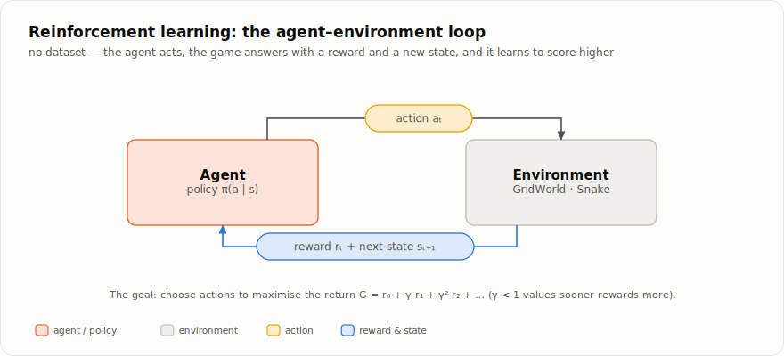

# الفصل 9 — التعلّم المُعزَّز الجدولي

تعلّم كلّ فصل حتى الآن من **مجموعة بيانات** (dataset): كومة من الأمثلة مرفقٌ بها
إجاباتها. يتعلّم نموذج GPT من نصّ تكون فيه "الإجابة" هي المحرف التالي؛ ويتعلّم
المُصنِّف من صور مصحوبة بتسميات. وكانت الخسارة تقارن تخمين النموذج بحقيقة معلومة.

أمّا التعلّم المُعزَّز فيرمي مفتاح الإجابات بعيدًا. لا توجد مجموعة بيانات. يُلقى
**وكيل** (agent) في لعبة، فيتّخذ **أفعالًا** (actions)، وكلّ ما تخبره به اللعبة على
الإطلاق هو **مكافأة** (reward) — رقم، جيّد أو سيّئ. لا أحد يقول أيّ فعل كان صائبًا.
على الوكيل أن *يكتشف* السلوك الجيّد بنفسه بتجربة الأشياء وملاحظة ما يؤتي ثماره.

هذا نوع مختلف حقًّا من التعلّم، ويبنيه الجزء الثالث على خطوتين. هذا الفصل يخطو
الخطوة *الأولى* على أصغر مسرح ممكن: شبكة تتّسع لها ذاكرتك، تنحصر فيها معرفة الوكيل
في **جدول** (table) بسيط من الأرقام — رقم واحد لكلّ حالة — دون أن تلوح في الأفق أيّ
شبكة عصبية. لِنُوضِّح الأفكار هنا، حيث لا شيء نختبئ خلفه، فتغدو خطوة الفصل التالي
سهلة: استبدل بالجدول شبكةً، فيصير التعلّم المُعزَّز الجدولي تعلّمًا مُعزَّزًا *عميقًا*.

## الدورة: وكيل، وبيئة، ومكافأة



التعلّم المُعزَّز كلّه هو تلك الدورة. في كلّ خطوة يرى الوكيل **حالة** (state) `s`
(كيف تبدو اللعبة الآن)، فيختار **فعلًا** (action) `a`، فتردّ البيئة بـ**مكافأة**
`r` وبالحالة التالية `s'`. دورةً بعد دورة.

هدف الوكيل ليس تعظيم المكافأة *التالية* — بل تعظيم **العائد** (return)، أي مجموع
المكافآت عبر الحلقة كاملة، مع خصم المكافآت المتأخّرة قليلًا:

```
G = r₀ + γ r₁ + γ² r₂ + …            (0 < γ < 1)
```

يعني معامل الخصم `γ` (غاما، نحو 0.99) أنّ "مكافأةً الآن تساوي أكثر بقليل من
المكافأة نفسها لاحقًا" — وهو ما يجعل، على نحو مفيد، *المسارات الأقصر* إلى المكافأة
أثمن من الطويلة.

اللعبة التي نتعلّم عليها هي **GridWorld**: وكيل على شبكة صغيرة، جدران يتجنّبها،
وهدف يبلغه. كلّ خطوة تكلّف `-1`؛ وبلوغ الهدف يمنح مكافأة إضافية قدرها `+10` وينهي
الحلقة. لذا لا يكون العائد مرتفعًا إلّا لمسار قصير ناجح — وهو تحديدًا السلوك الذي
نريد للوكيل أن يجده. وهي تتكلّم لغة `reset` / `step` نفسها التي تتكلّمها أيّ بيئة من
بيئات Gym:

```python
from gridworld import GridWorld
env = GridWorld()
obs, _ = env.reset()                       # obs: a 6-number view of the cell
obs, reward, done, info = env.step(2)      # action in 0..3 (up/down/left/right)
```

لأنّ GridWorld رقعة 5×5 يشقّها جدار في المنتصف، فليس فيها سوى بضع عشرات من الخلايا.
وهذا صغير بما يكفي لتسمية **كلّ حالة** — وهذا بالضبط ما يجعل الجدول ممكنًا.

## قيمة الحالة

دَعْ عنك اختيار الأفعال لحظةً واسأل سؤالًا أبسط: ما مدى *جودة* أن تكون في خليّة
بعينها؟ سَمِّ ذلك الرقم **قيمة** (value) الحالة `V(s)` — أفضل عائد لا يزال بمقدورك
جمعه انطلاقًا من `s`. خليّة مجاورة للهدف تساوي نحو `+9`؛ وخليّة في الركن البعيد
تساوي أقلّ بكثير، لأنّ الخروج منها يكلّف مسيرة طويلة من `-1`.

للقيم بنية ذاتية المرجعية بديعة. قيمة الخليّة هي مكافأة الخروج منها زائد القيمة
(المخصومة) للمكان الذي تهبط فيه تلك الخطوة — مع اتّخاذ *أفضل* خطوة متاحة:

```
V(s)  =  maxₐ [ r(s, a)  +  γ · V(s') ]
```

هذه هي **معادلة بلمان** (Bellman equation)، وهي محرّك كلّ شيء في هذا الفصل والذي
يليه. إنّها نقطة ثابتة: القيم الحقيقية هي التي تجعل الطرفين متساويين. خزِّن رقمًا
واحدًا لكلّ حالة في قاموس — هو **الجدول** — والمهمّة أن تملأه بقيم تُحقِّق المعادلة.
ويتّصل بها اتّصالًا وثيقًا مفهوم **قيمة الفعل** (action-value) `Q(s, a)`: قيمة
اتّخاذ الفعل `a` *أوّلًا*، ثمّ التصرّف تصرّفًا حسنًا بعد ذلك. ومتى امتلكت أيًّا من
الجدولين، صار التصرّف بسيطًا — في كلّ حالة، اتّخذ الفعل ذا القيمة الأعلى.

طريقتان لملء الجدول. إن *أُعطيت قواعد اللعبة* — كلّ حالة، وإلى أين يقود كلّ فعل —
أمكنك حساب القيم مباشرةً؛ وذلك هو **البرمجة الديناميكية** (dynamic programming).
وإن لم تُعطَها، فعليك أن *تلعب* وتتعلّم ممّا يحدث؛ وذلك هو **تعلّم الفرق الزمني**
(temporal-difference learning). وGridWorld يتيح لنا كلتا الطريقتين.

## القائم على النموذج: البرمجة الديناميكية

البرمجة الديناميكية هي الحالة السهلة: يُعطى الوكيل **نموذجًا** (model) للعالم.
تمنحه GridWorld ثلاث دوالّ — `states()` (كلّ خليّة)، و`is_terminal(s)` (أهذه هي
الهدف؟)، و`transition(s, a)` (إلى أين يقود هذا الفعل، وبأيّ مكافأة؟). ولأنّ
GridWorld حتميّة، يكون الانتقال زوجًا واحدًا `(s', r)`، لا توزيعًا احتماليًّا — وهو
ما يُبقي تحديث بلمان مجرّد `max`، دون توقّع نحسب متوسّطه.

**تكرار القيمة** (value iteration) يطبّق معادلة بلمان بوصفها *إسنادًا*: امسح كلّ
حالة، واكتب فوق قيمتها أفضل `r + γ · V(s')`، وكرِّر حتى لا يتغيّر شيء. كلّ مسحة
تدفع القيمة خطوةً أبعد خارجةً من الهدف؛ وبعد مسحات كافية تصير الرقعة كلّها صحيحة.

<details>
<summary><b>كيف يُنفَّذ ذلك</b> — <code>tutorials/rl/tabular.py</code> (تحديث بلمان الأمثل)</summary>

```python
def value_iteration(env, gamma=0.99, theta=1e-6):
    # ...
    V = {s: 0.0 for s in env.states()}
    while True:
        delta = 0.0
        for s in env.states():
            if env.is_terminal(s):
                continue
            best = max(r + gamma * V[ns]
                       for ns, r in (env.transition(s, a)
                                     for a in range(env.n_actions)))
            delta = max(delta, abs(best - V[s]))
            V[s] = best
        if delta < theta:
            break
    return V, _greedy_from_v(env, V, gamma)
```

</details>

يتوقّف التكرار حين يهبط أكبر تغيّر في أيّ خليّة (`delta`) دون `theta` ضئيلة — فقد
كفّ الجدول عن الحركة، أي إنّه تقارب. والسياسة المُعادة *جشِعة*: في كلّ حالة، اختر
الفعل الذي يكون `r + γ · V(s')` عنده الأكبر.

**تكرار السياسة** (policy iteration) يبلغ الأمثل نفسه بمسلك مختلف. يناوب بين
خطوتين مضبوطتين: *تقييم* السياسة الحالية (حلّ `V` للأفعال التي تتّخذها حاليًّا، بلا
`max`)، ثمّ *تحسينها* (التصرّف جشِعًا إزاء ذلك `V`). كرِّر حتى تكفّ السياسة عن
التغيّر. وكثيرًا ما يستغرق مسحات أقلّ من تكرار القيمة، لأنّ كلّ تقييم يحلّ السياسة
الحالية بالضبط بدل أن يأخذ خطوة بلمان واحدة. وكلاهما يستقرّ على السياسة المثلى
نفسها — فليس ثمّة إلّا طريق واحد أفضل عبر المتاهة.

## الخالي من النموذج: التعلّم باللعب

البرمجة الديناميكية تحتاج إلى كُتيّب القواعد. لكنّ وكيلًا يواجه لعبة حقيقية *لا*
يحصل على دالّة `transition` — كلّ ما يحصل عليه هو أن يتحرّك ويرى ما يحدث. **التحكّم
بالفرق الزمني** (temporal-difference control) يتعلّم من ذلك بالضبط: العب اللعبة،
وبعد كلّ خطوة اِدفع قيمة المكان الذي *كنت* فيه نحو المكافأة التي نلتها زائد قيمة
المكان الذي *هبطت* فيه. وذلك "زائد قيمة المكان الذي هبطت فيه" هو معادلة بلمان من
جديد، مستخدَمةً هدفًا للتعلّم بدل أن تكون إسنادًا.

يتعلّم الفرق الزمني جدول `Q` (قيم الأفعال)، لأنّك بلا نموذج لا تستطيع تحويل قيمة
حالة إلى فعل — تحتاج إلى قيمة الأفعال نفسها. والحالة هنا هي ببساطة خليّة الوكيل،
الزوج `(row, col)` أي `env.pos`، فيكون `Q` قاموسًا من الخليّة إلى أربع قيم أفعال.
ولكي يبقى الوكيل مستكشِفًا، يتصرّف بأسلوب **ε-جشِع** (ε-greedy): يتّخذ عادةً الفعل
الأفضل المعروف، لكنّه باحتمال ε يختار عشوائيًّا، فلا يكفّ أبدًا عن الاكتشاف. تلك
الدالّة المساعدة الوحيدة هي منبع كلّ الاستكشاف:

<details>
<summary><b>كيف يُنفَّذ ذلك</b> — <code>tutorials/rl/tabular.py</code> (اختيار الفعل بأسلوب ε-جشِع)</summary>

```python
def _epsilon_greedy(Q, s, n_actions, epsilon):
    if np.random.random() < epsilon:
        return np.random.randint(n_actions)
    return int(np.argmax(Q[s]))
```

</details>

**SARSA** هي النسخة *داخل السياسة* (on-policy): تُحدِّث نحو قيمة الفعل الذي
*ستتّخذه فعلًا في الخطوة التالية* (`a'`، المسحوب من سياسة ε-جشِع نفسها). فتتعلّم
بذلك قيمة السلوك الذي تتّبعه حقًّا، بما فيه من استكشاف. واسمها هو الانتقال الذي
تستخدمه — حالة، وفعل، ومكافأة، وحالة، وفعل (state, action, reward, state, action):

<details>
<summary><b>كيف يُنفَّذ ذلك</b> — <code>tutorials/rl/tabular.py</code> (SARSA: التحديث نحو الفعل المُتّخَذ فعلًا)</summary>

```python
        while not done:
            _, r, done, _ = env.step(a)
            ns = env.pos
            na = _epsilon_greedy(Q, ns, env.n_actions, epsilon)
            target = r + (0.0 if done else gamma * Q[ns][na])
            Q[s][a] += alpha * (target - Q[s][a])
            s, a = ns, na
```

</details>

**تعلّم Q** (Q-learning) هو النسخة *خارج السياسة* (off-policy)، والتغيير الوحيد هو
بيت القصيد كلّه: يستخدم الهدف `max Q(s', ·)` — قيمة *أفضل* فعل تالٍ — بدل قيمة
الفعل الذي تصادف أن يتّخذه. فيتعلّم بذلك قيم السياسة المثلى بينما لا يزال يتجوّل
بأسلوب ε-جشِع ليجمع الخبرة. وهو السلف الجدولي المباشر لشبكة DQN في الفصل التالي.

<details>
<summary><b>كيف يُنفَّذ ذلك</b> — <code>tutorials/rl/tabular.py</code> (تعلّم Q: التحديث نحو أفضل فعل تالٍ)</summary>

```python
        while not done:
            a = _epsilon_greedy(Q, s, env.n_actions, epsilon)
            _, r, done, _ = env.step(a)
            ns = env.pos
            target = r + (0.0 if done else gamma * np.max(Q[ns]))
            Q[s][a] += alpha * (target - Q[s][a])
            s = ns
```

</details>

إنّ `target − Q[s][a]` هو **خطأ الفرق الزمني** (TD error): الفجوة بين ما يعتقده
الوكيل الآن وما كان يعتقده قبل خطوة. و`alpha` (معدّل التعلّم) يتحكّم في مدى ما
تُغلقه كلّ خطوة من تلك الفجوة. لا تدرُّجات، ولا `backward()` — مجرّد متوسّط جارٍ،
ينجرف نحو نقطة بلمان الثابتة خطوةً ملعوبة في كلّ مرّة.

## شغِّله

```bash
cd tutorials/rl
python tabular.py
```

تطبع الطرق الأربع جميعها سياستها أسهمًا على الرقعة. والطريقتان القائمتان على النموذج
تتّفقان بالضبط — مسار أمثل واحد — والطريقتان الخاليتان من النموذج تستعيدانه أيضًا،
على الأقلّ في الخلايا التي تهمّ:

```
Value iteration (model-based, exact):
↓ → ↓ ↓ ↓
↓ # ↓ ↓ ↓
↓ # ↓ ↓ ↓
↓ # ↓ ↓ ↓
→ → → → G

Q-learning (model-free, off-policy, 500 episodes):
→ → ↓ ↓ ↓
↑ # ↓ ↓ ↓
↓ # → → ↓
↓ # ↓ ↓ ↓
→ → → → G

Q-learning agrees with the exact optimum on 81% of states.
```

كلّ مواطن الاختلاف تقع في خلايا *خارج* المسارات الجيّدة — أركان لا يزورها الوكيل
الأمثل قطّ، فبالكاد أخذ منها تعلّم Q عيّنات ولم يشحذ قيمها أبدًا. وفي كلّ خليّة تقع
على طريق معقول إلى الهدف، يطابق الجدولُ المُستخرَج باللعب الجدولَ المضبوط. تلك هي
وعد الخالي من النموذج: لا كُتيّب قواعد، ومع ذلك يجد الطريق.

## لماذا لا يكفي الجدول

كلّ ما هنا يقوم على ترف واحد: جدول فيه **خليّة واحدة لكلّ حالة**. لدى GridWorld بضع
عشرات منها. لكن اجعل الشبكة صورةً فوتوغرافية، أو الرقعة لعبة غو (Go)، أو الحالة
فقرةً من نصّ، فينفجر عدد الحالات متجاوزًا كلّ ذرّة في الكون — لا جدول يسعها، ولن
يزور الوكيل أيّ حالة مفردة مرّتين ليتعلّمها.

والحلّ هو الفكرة التي يُبنى عليها بقيّة الجزء الثالث: **استبدل بالجدول شبكةً**.
تقرأ الشبكة الحالة و*تُعمِّم* — فتعطي قيمة معقولة لحالات لم ترها قطّ، مثلما يُسمّي
مُصنِّف الفصل الثالث صورًا لم يُدرَّب عليها قطّ. الفصل العاشر يفعل هذا بالضبط
بـ*السياسة* (تعلّم كيف تتصرّف مباشرةً)، والفصل الحادي عشر يفعله بجدول `Q` في هذا
الفصل (تعلّم قيمة الأفعال). وكلّ فكرة التقيتها للتوّ — العائد، والخصم، وهدف بلمان،
والفعل الجشِع، والاستكشاف — تنتقل مباشرةً. لا يتغيّر إلّا الجدول.

## تمارين

**اختبر فهمك** (الإجابات تُفتَح):

**س1.** يحتاج تكرار القيمة إلى `env.transition` و`env.states`؛ ولا يحتاج تعلّم Q
إلى أيٍّ منهما. ما الذي يستطيعه تعلّم Q ولا يستطيعه تكرار القيمة — وما الذي يتخلّى
عنه مقابل ذلك؟

<details><summary>الإجابة</summary>

يستطيع تعلّم Q أن يتعلّم في عالمٍ لا يعرف قواعده — يكفي أن يكون قادرًا على *لعبه*،
وهي الحالة الواقعية (لا أحد يناولك دالّة انتقال في أتاري أو غو). أمّا ما يتخلّى عنه
فهو الدقّة والكفاءة: لا يتعلّم إلّا عن الحالات التي يزورها فعلًا، فتبقى الخلايا
نادرة الظهور خاطئة (نسبة الـ 81%)، ويحتاج إلى حلقات كثيرة من التجربة والخطأ حيث
تحسب البرمجة الديناميكية الجواب في مسحات قليلة.

</details>

**س2.** يختلف SARSA وتعلّم Q في حدٍّ واحد: هدف SARSA يستخدم `Q[ns][na]` (الفعل
التالي المُختار فعلًا)، وهدف تعلّم Q يستخدم `max Q[ns]` (أفضل فعل تالٍ). أيّهما
يتعلّم قيمة مسار *آمن* حين يكون الاستكشاف محفوفًا بالخطر، ولماذا؟

<details><summary>الإجابة</summary>

SARSA. لأنّه يعتمد في تقديره على الفعل الذي *سيتّخذه فعلًا* — بما في ذلك الحركة
العشوائية ε-جشِعة العَرَضيّة — تُراعي قيمُه كلفة الاستكشاف. فإن كان التسكّع قرب
حافّة هاوية يُسقِط أحيانًا، تعلّم SARSA أن يمنح حافّة الهاوية هامشًا واسعًا. أمّا
تعلّم Q فيتعلّم قيمة السياسة *المثلى* بصرف النظر عن الحركات الاستكشافية التي يقوم
بها، فيمشي على حافّة الهاوية مطمئنًّا، واثقًا بأنّه سيتصرّف تصرّفًا مثاليًّا. وفي
GridWorld، حيث الخطوة الخاطئة رخيصة، يتقارب كلاهما إلى الطريق نفسه.

</details>

**س3.** في `q_learning`، يكون الهدف `r + (0.0 if done else gamma *
np.max(Q[ns]))`. لماذا يُجبَر حدّ المستقبل على الصفر في الخطوة التي تبلغ الهدف؟

<details><summary>الإجابة</summary>

لأنّ لا شيء يتبع الحالة النهائية — فقد انتهت الحلقة، فلا فعل تالٍ ولا مكافأة
مستقبلية تُضاف. والاعتماد على `Q[ns]` هناك يخترع قيمة من العدم (و`ns` هي الهدف
الماصّ، الذي ينبغي أن تكون قيمته مكافأته هو بالضبط). وتصفير حدّ المستقبل يُرسي
الجدول كلّه: إنّه الموضع الوحيد الذي تُعرف فيه قيمة *دون* الرجوع إلى قيمة أخرى، ومنه
تُنشَر قيمة كلّ خليّة أخرى رجوعًا في نهاية المطاف.

</details>

**اِبنِه** — أضِف دالّة مساعدة `render_values` تطبع `V(s)` لكلّ خليّة شبكةَ أرقام
(مثلما تطبع `render_policy` الأسهم)، وراقب القيمة تنتشر خارجةً من الهدف مسحةً في
كلّ مرّة باستدعائها داخل حلقة `value_iteration`.

---

**الشيفرة:**
[`tutorials/rl/tabular.py`](../../tutorials/rl/tabular.py) ·
[`tutorials/rl/gridworld.py`](../../tutorials/rl/gridworld.py) ·
[`tests/test_rl.py`](../../tests/test_rl.py) (الطرق الأربع، مع إثبات اتّفاقها)

[→ الفصل 8: تدريب GPT](08-training-a-gpt.md) | [المحتويات](README.md) | [الفصل 10: تدرُّجات السياسة ←](10-policy-gradients.md)
