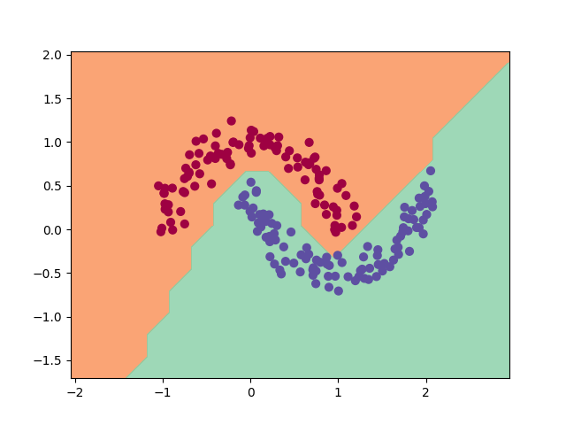

## Exploring Classification with BabyTorch: A Step-by-Step Guide

**Learn with BabyTorch and remove the word "Baby" to transition to PyTorch!**

### Introduction

This tutorial walks through a *binary classification* task: separating
the two interleaved half-moons below. No straight line can split them,
so the network's non-linearities have to do real work.

<div>

</div>

For the ideas behind the code (layers, losses, the training loop), see
[Part I of the book](../../../book/README.md).

### Installation

Install BabyTorch with the visualization extra (this also brings in
`numpy` and `matplotlib` — nothing else is needed; the dataset is
generated with a few lines of NumPy):

```bash
pip install -e ".[viz]"
```

### Building the classification model

1. **Generate and prepare data**:
   - Two half-circles of points, plus noise (the same shape sklearn's
     `make_moons` produces).
   - Labels are scaled to −1 / +1 to match the model's unbounded output.
   ```python
   X_orig, y_orig = make_moons(n_samples=200, noise=0.1)
   X = Tensor(X_orig)
   y = Tensor(y_orig * 2 - 1).reshape(-1, 1)   # labels as a column of -1/+1
   ```

2. **Define the model**:
   - Two input features (the point's coordinates), three hidden ReLU
     layers, one output score whose sign is the predicted class.
   ```python
   model = Sequential(
       nn.Linear(2, 64, nn.ReLU()),
       nn.Linear(64, 32, nn.ReLU()),
       nn.Linear(32, 16, nn.ReLU()),
       nn.Linear(16, 1),
   )
   ```

3. **Set up the optimizer and loss function**:
   ```python
   optimizer = SGD(model.parameters(), learning_rate=0.01, weight_decay=0.0005)
   criterion = MSELoss()
   ```

4. **Training loop**:
   - Forward pass, loss, backward pass; then clip the gradients (a
     safeguard against exploding gradients) and update the weights.
   ```python
   for epoch in range(num_iterations):
       y_pred = model(X)
       loss = criterion(y_pred, y)
       optimizer.zero_grad()
       loss.backward()
       clip_gradients_norm(model.parameters(), max_norm=10.0)
       optimizer.step()
   ```

5. **Visualize the loss**:
   ```python
   grapher = Grapher()
   grapher.plot_loss(losses)
   grapher.show()
   ```

6. **Visualize the decision boundary**:
   - Classify every point of a grid and color the plane by the model's
     answer.
   ```python
   xx, yy = np.meshgrid(np.arange(x_min, x_max, h), np.arange(y_min, y_max, h))
   Xmesh = np.c_[xx.ravel(), yy.ravel()].astype(np.float32)

   with babytorch.no_grad():
       scores = model(Tensor(Xmesh))
   Z = (scores.numpy() > 0).reshape(xx.shape)

   plt.contourf(xx, yy, Z, cmap=plt.cm.Spectral, alpha=0.8)
   plt.scatter(X_orig[:, 0], X_orig[:, 1], c=y_orig, s=40, cmap=plt.cm.Spectral)
   plt.show()
   ```

### Conclusion

A network this small learns the moons in a few seconds and draws a
smooth, curved boundary between them — something no linear model can do.
The same recipe (model → loss → loop → evaluate) scales directly to the
MNIST tutorials one directory up.

### Code

The complete code for this tutorial is in
[`classification_02.py`](classification_02.py).
A more basic example — and a side-by-side BabyTorch/PyTorch comparison,
run automatically when PyTorch is installed — is in
[`classification_01.py`](classification_01.py).
