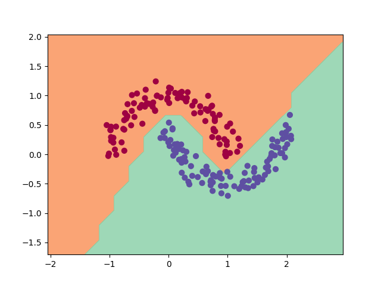

### Exploring Classification with BabyTorch: A Step-by-Step Guide

**Learn with BabyTorch and remove the word "Baby" to transition to PyTorch!**

#### Introduction to BabyTorch
This tutorial introduces you to a basic classification task using BabyTorch, using the `make_moons` dataset from `sklearn` to demonstrate _binary classification_.
<div>

</div>

#### Installation
Ensure that BabyTorch and the required dependencies (`numpy`, `matplotlib` and `sklearn`  for data manipulation, visualization, and datasets generation, respectively) are installed. If BabyTorch is _not_ installed, follow this <a target="_blank" href="/README.md"> guide </a> to install it. The `numpy` and `matplotlib` will be automatically installed with BabyTorch and you can install `sklearn` using `pip install scikit-learn`.

#### Building the Classification Model
Here’s a breakdown of the process to build and train a model for classifying the `make_moons` dataset:

1. **Generate and Prepare Data**: 
   - Use `make_moons` from `sklearn.datasets` to create your dataset. Adjust `noise` to add complexity.
   - Format the labels for binary classification.
   -  ```python
      # generate 200 points of data with 0.1 noise
      X_orig, y_orig = make_moons(n_samples=200, noise=0.1) 
      # Scale and shift the labels (the y data) to be between -1 and 1
      y_orig = y_orig * 2 - 1  
      # Convert the data to tensors for BabyTorch 
      X = Tensor(X_orig, require_grad=True)
      y = Tensor(y_orig, require_grad=True)
      # Reshape the y data to be a column vector
      y = y.reshape(-1, 1)

2. **Define the Model**:
   - Define a simple neural network model with two hidden layers and ReLU activation functions. The model takes two input features  (Cartezian coordinates) and outputs a single value for binary classification.
   - Use BabyTorch’s `Sequential` model to stack these layers.
   - ```python 
      model = Sequential(
         nn.Linear(2, 64, nn.ReLU()),
         nn.Linear(64, 32, nn.ReLU()),
         nn.Linear(32, 16, nn.ReLU()),
         nn.Linear(16, 1)
      )
3. **Set Up the Optimizer and Loss Function**:
   - Utilize BabyTorch’s `SGD` optimizer and mean squared error loss.
   - ```python 
      optimizer = SGD(model.parameters(), learning_rate=learning_rate, weight_decay=0.0005)
      criterion = MSELoss()
4. **Training Loop**:
   - The dataset is small therefore, it is passed through the model in a single batch.
   - calculate loss, 
   - backpropogate the loss to allow gradients calculation,
   - clip the gradients to a max value to prevent exploding gradients and update the model weights.
   - ```python
      for epoch in range(num_iterations):
         optimizer.zero_grad()
         y_pred = model(X)
         loss = criterion(y_pred, y)
         loss.backward()
         clip_gradients_norm(model.parameters(), max_norm=10.0)
         optimizer.step()
         print(f"Epoch {epoch+1}/{num_iterations}, Loss: {loss.item()}")

5. **Visualize the Loss**:
   - Plot the training loss over epochs to observe learning progress.
   - ```python 
      Grapher().plot_loss(losses)
      Grapher().show()
6. **Visualize the Decision Boundary**:
   - After training, plot the decision boundary to see how well your model separates the dataset.
   - ```python
      h = 0.25
      x_min, x_max = X_orig[:, 0].min() - 1, X_orig[:, 0].max() + 1
      y_min, y_max = X_orig[:, 1].min() - 1, X_orig[:, 1].max() + 1
      xx, yy = np.meshgrid(np.arange(x_min, x_max, h), np.arange(y_min, y_max, h))
      Xmesh = np.c_[xx.ravel(), yy.ravel()]
      scores = model(Tensor(Xmesh))
      Z = np.array([s > 0 for s in scores])
      Z = Z.reshape(xx.shape)

      plt.contourf(xx, yy, Z, cmap=plt.cm.Spectral, alpha=0.8)
      plt.scatter(X_orig[:, 0], X_orig[:, 1], c=y_orig, s=40, cmap=plt.cm.Spectral)
      plt.xlim(xx.min(), xx.max())
      plt.ylim(yy.min(), yy.max())
      plt.show()

#### Conclusion
Using BabyTorch for a simple classification task not only helps solidify fundamental concepts in neural networks but also prepares you for more complex tasks in deep learning. By following this guide, you can build a foundational understanding of how models learn and how to manipulate data effectively.

This introduction to using BabyTorch for a binary classification task provides the groundwork for more advanced studies and applications in deep learning.